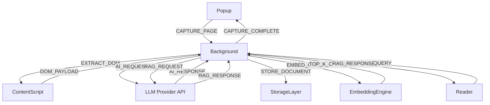
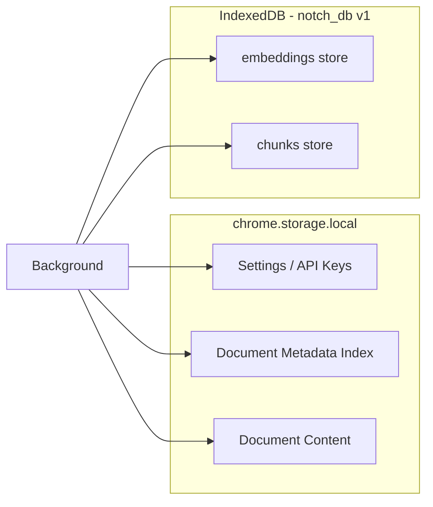
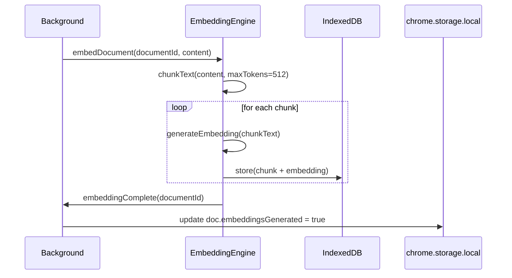
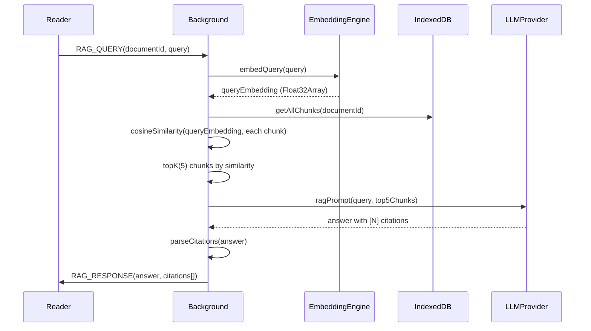
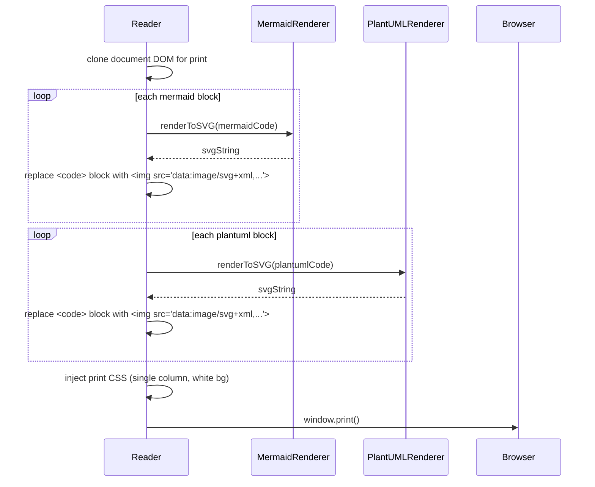

# Design Document: Notch Browser Extension

## Overview

Notch is a brutalist dark-mode browser extension that captures web pages, processes them through a BYOK LLM pipeline, and stores structured markdown documents entirely on the client. The system has no backend — all data lives in Chrome `storage.local` and IndexedDB, all AI calls go directly from the browser to the provider API using the user's own key.

The extension is built on WXT (a Vite-based extension framework), React 19, Tailwind CSS v4, and shadcn/ui. It targets Chrome and Chromium-compatible browsers.

### Key Design Principles

- **Zero-backend**: No server, no auth, no sign-up. All persistence is local.
- **BYOK**: User supplies their own LLM API key. The extension never proxies or stores keys server-side.
- **Brutalist UI**: 0px border radius, no drop shadows, monospace labels, high-information density.
- **Offline-capable**: Library browsing, reading, and RAG chat work without network (after initial capture).

---

## Architecture

### Extension Surfaces

WXT compiles each surface as a separate entry point:

```
src/entrypoints/
  background.ts          — Service worker: message routing, storage ops, API calls
  content.ts             — Content script: DOM extraction, text selection events
  popup/                 — 320×480px capture interface
  options/               — Full-tab Settings & Onboarding screen
  newtab/ (or tabs/)     — Library dashboard (full tab)
  reader/                — Reader + RAG Chat (full tab, opened programmatically)
```

### Message Passing Architecture

All cross-surface communication goes through the background service worker using `browser.runtime.sendMessage` / `browser.tabs.sendMessage`. This keeps API keys and storage operations centralized and out of content scripts.



### Message Protocol

All messages follow a typed discriminated union:

```typescript
type NotchMessage =
  | { type: 'CAPTURE_PAGE'; payload: { tabId: number; mode: GenerationMode; tags: string[] } }
  | { type: 'EXTRACT_DOM'; payload: {} }
  | { type: 'DOM_PAYLOAD'; payload: DOMExtraction }
  | { type: 'CAPTURE_COMPLETE'; payload: { documentId: string } }
  | { type: 'CAPTURE_ERROR'; payload: { error: string } }
  | { type: 'RAG_QUERY'; payload: { documentId: string; query: string } }
  | { type: 'RAG_RESPONSE'; payload: { answer: string; citations: Citation[] } }
  | { type: 'RAG_ERROR'; payload: { error: string } }
  | { type: 'STORAGE_QUOTA_WARNING'; payload: { usedBytes: number; quotaBytes: number } };
```

### Storage Architecture



`chrome.storage.local` holds settings and document content (up to ~10MB total). IndexedDB holds embeddings and chunk text (no practical size limit for the use case).

---

## Components and Interfaces

### Popup Surface

```
PopupApp
├── StatusBar                    — NOTCH wordmark + provider connection dots
├── PageContextZone              — Active tab title, domain, word count estimate
├── ModeSelector                 — FAST / DEEP / LOCAL toggle
├── TagInput                     — Tag entry + chip list
├── CaptureButton                — CAPTURE PAGE / PARSING... / OPEN IN READER → / ERROR — RETRY
└── NoKeyWarning                 — Inline error when no key configured
```

**CaptureButton states:**
- `idle` → `[CAPTURE PAGE]`, violet border
- `loading` → `[PARSING...]`, pulsing opacity animation
- `success` → `[OPEN IN READER →]`, surface background
- `error` → `[ERROR — RETRY]`, danger red border

### Library Surface

```
LibraryApp
├── Sidebar
│   ├── NotchLogo
│   ├── NavItem: ALL DOCUMENTS
│   ├── NavItem: FAVORITES
│   ├── NavItem: ARCHIVE
│   └── NavItem: SETTINGS
├── MainArea
│   ├── LibraryHeader            — LIBRARY_ROOT heading + sort control
│   ├── SearchInput              — / shortcut, fuzzy search
│   ├── StorageQuotaWarning      — shown when >90% full
│   ├── DocumentGrid             — 4-column responsive card grid
│   │   └── DocumentCard (×n)
│   │       ├── DomainLabel
│   │       ├── DocumentTitle
│   │       ├── TagChipList
│   │       └── CardMeta         — word count, date, READ/UNREAD, star, archive
│   └── EmptyState               — NO DOCUMENTS FOUND. CAPTURE SOMETHING.
└── StatusBar                    — document count, storage usage
```

### Reader Surface

```
ReaderApp
├── ReaderTopBar
│   ├── Breadcrumb               — LIBRARY / [TITLE] in JetBrains Mono
│   ├── TabSwitcher              — [NOTES] / [CHAT] tabs
│   └── ExportMenu               — [EXPORT .MD] / [EXPORT PDF]
├── LeftPane (70%)
│   ├── DocumentRenderer         — markdown → HTML with syntax highlighting
│   │   ├── MermaidBlock         — renders fenced mermaid blocks as SVG
│   │   └── PlantUMLBlock        — renders fenced plantuml blocks as SVG
│   └── SelectionTooltip         — [HIGHLIGHT] / [ASK AI] on text selection
└── RightPane (30%)
    ├── NotesPanel (default)
    │   ├── SummarySection
    │   ├── KeyEntitiesSection
    │   ├── TimelineSection
    │   └── ConceptsSection
    └── ChatPanel (when CHAT tab active)
        ├── ContextPill           — CHATTING WITH: [title]
        ├── MessageList
        │   ├── UserBubble
        │   └── NotchBubble       — with CitationChip[n] inline
        ├── ThinkingIndicator     — [NOTCH IS THINKING █] blinking cursor
        └── ChatInput             — multiline, Enter=submit, Shift+Enter=newline
```

### Settings Surface

```
SettingsApp
├── GettingStartedSection        — GETTING STARTED + quickstart link
├── ProviderBlock × 3            — Gemini / OpenAI / Anthropic
│   ├── PasswordInput            — key entry
│   ├── ValidationIndicator      — [VERIFIED] / [INVALID]
│   └── GetKeyLink               — GET API KEY ↗
├── GenerationModeSection
│   └── ModeOption × 3           — FAST / DEEP / LOCAL with descriptions
└── SaveButton                   — [SAVE SETTINGS] / [SETTINGS SAVED ✓]
```

---

## Data Models

### Document

```typescript
interface Document {
  id: string;                    // UUID v4
  title: string;                 // AI-extracted or page <title>
  url: string;                   // Source URL
  domain: string;                // Extracted from URL
  capturedAt: string;            // ISO 8601 timestamp
  wordCount: number;             // Approximate word count of source
  mode: GenerationMode;          // FAST | DEEP | LOCAL
  provider: LLMProvider;         // gemini | openai | anthropic | ollama
  content: string;               // Full structured markdown
  summary: string;               // AI-generated summary (also in content)
  keyEntities: Entity[];         // Named entities extracted by AI
  timeline: TimelineEvent[];     // Chronological events (if applicable)
  concepts: Concept[];           // Key concepts
  tags: string[];                // User-defined tags
  images: ImageRef[];            // Image references with semantic positions
  isStarred: boolean;
  isArchived: boolean;
  isRead: boolean;
  embeddingsGenerated: boolean;  // Whether IndexedDB embeddings exist
  missingImageQueries: string[]; // Web search suggestions for broken images
}

type GenerationMode = 'FAST' | 'DEEP' | 'LOCAL';
type LLMProvider = 'gemini' | 'openai' | 'anthropic' | 'ollama';

interface Entity {
  name: string;
  type: string;                  // person | org | concept | technology | etc.
  paragraphIndex: number;        // Source paragraph for scroll-linking
}

interface TimelineEvent {
  date: string;
  description: string;
  paragraphIndex: number;
}

interface Concept {
  term: string;
  definition: string;
  paragraphIndex: number;
}

interface ImageRef {
  url: string;
  alt: string;
  sectionIndex: number;          // Which document section this image belongs to
  paragraphContext: string;      // Surrounding text at capture time
}
```

### Embedding / Chunk

```typescript
interface DocumentChunk {
  id: string;                    // `${documentId}_${chunkIndex}`
  documentId: string;
  chunkIndex: number;
  text: string;                  // Raw chunk text (≤512 tokens)
  paragraphIndex: number;        // Maps back to rendered paragraph for citations
  embedding: Float32Array;       // 384-dim vector from transformers.js
}
```

### Settings

```typescript
interface Settings {
  apiKeys: {
    gemini?: string;
    openai?: string;
    anthropic?: string;
  };
  ollamaEndpoint: string;        // default: 'http://localhost:11434'
  defaultMode: GenerationMode;
  ollamaModel: string;           // default: 'llama3'
}
```

### Tag (derived)

Tags are stored as `string[]` on each Document. The Library derives the full tag set by aggregating across all documents. No separate Tag collection is needed.

---

## Storage Schema

### chrome.storage.local

```
notch:settings          → Settings (JSON)
notch:doc:index         → string[]  (array of document IDs, ordered by capturedAt desc)
notch:doc:{id}          → Document  (full document object as JSON)
```

The index array allows the Library to load metadata without deserializing every document. The 10MB quota is monitored; a warning fires when usage exceeds 9MB.

**Quota monitoring:**

```typescript
async function checkStorageQuota(): Promise<void> {
  const bytesInUse = await chrome.storage.local.getBytesInUse();
  const QUOTA = 10 * 1024 * 1024; // 10MB
  if (bytesInUse > QUOTA * 0.9) {
    browser.runtime.sendMessage({ type: 'STORAGE_QUOTA_WARNING', payload: { usedBytes: bytesInUse, quotaBytes: QUOTA } });
  }
}
```

### IndexedDB — `notch_db` v1

```
Object Store: chunks
  keyPath: id  (string: `${documentId}_${chunkIndex}`)
  indexes:
    - documentId (non-unique) — for fetching all chunks of a document
    - chunkIndex (non-unique)

Object Store: embeddings
  keyPath: id  (string: `${documentId}_${chunkIndex}`)
  indexes:
    - documentId (non-unique)
```

Embeddings and chunks share the same key structure so they can be joined by ID. Storing them separately allows deleting embeddings independently if re-embedding is needed.

**Atomic document deletion:**

```typescript
async function deleteDocument(id: string): Promise<void> {
  // 1. Remove from chrome.storage.local
  const index = await getDocIndex();
  await chrome.storage.local.remove([`notch:doc:${id}`]);
  await chrome.storage.local.set({ 'notch:doc:index': index.filter(i => i !== id) });

  // 2. Remove all chunks and embeddings from IndexedDB
  const db = await openDB();
  const tx = db.transaction(['chunks', 'embeddings'], 'readwrite');
  const chunkIds = await tx.objectStore('chunks').index('documentId').getAllKeys(id);
  for (const key of chunkIds) {
    tx.objectStore('chunks').delete(key);
    tx.objectStore('embeddings').delete(key);
  }
  await tx.done;
}
```

---

## AI Prompt Templates

### FAST Mode (Gemini Flash / GPT-4o-mini)

```
You are a document structuring assistant. Given the following web page content, produce a structured markdown document.

Requirements:
- Title: Extract or infer a clear document title
- Summary: 2-3 sentence summary
- Key Entities: List named people, organizations, technologies, and concepts with brief descriptions
- Main Content: Restructure the content into logical sections with ## headings
- For any ASCII art diagrams or flowcharts, convert them to fenced ```mermaid``` code blocks
- For any software architecture or sequence descriptions, convert them to fenced ```plantuml``` code blocks
- Place image references (provided as [IMG: url | alt | context]) adjacent to the most semantically relevant section
- Timeline: If the content is chronological, extract a timeline section

Output ONLY valid markdown. Do not include any preamble or explanation.

PAGE CONTENT:
{content}

IMAGE REFERENCES:
{imageRefs}
```

### DEEP Mode (Gemini Pro / GPT-4o)

```
You are an expert knowledge structuring assistant. Given the following web page content, produce a comprehensive structured markdown document suitable for a developer's knowledge base.

Requirements:
- Title: Extract or infer a precise document title
- Summary: 4-6 sentence executive summary
- Key Entities: Exhaustive list of named entities (people, orgs, technologies, concepts, APIs, tools) with types and descriptions
- Timeline: Chronological events if applicable, with dates
- Concepts: Deep explanations of key technical or conceptual terms
- Main Content: Restructure into logical sections with ## headings and ### sub-headings
- Code blocks: Preserve all code blocks with correct language identifiers
- Diagrams: Convert ALL ASCII art, flowcharts, and architecture descriptions to appropriate ```mermaid``` or ```plantuml``` fenced blocks
- Images: Place each image reference at the most semantically relevant position in the document
- Cross-references: Add internal markdown links between related sections where appropriate

Output ONLY valid markdown. Do not include any preamble or explanation.

PAGE CONTENT:
{content}

IMAGE REFERENCES:
{imageRefs}
```

### RAG Query Prompt

```
You are a precise question-answering assistant. Answer the user's question using ONLY the provided document excerpts. 

Rules:
- Cite each piece of information with [N] where N is the excerpt number
- If the answer is not in the excerpts, say "I cannot find that in this document."
- Be concise and direct
- Do not hallucinate information not present in the excerpts

DOCUMENT EXCERPTS:
{chunks}

USER QUESTION:
{query}
```

---

## Embedding and RAG Pipeline

### Embedding Generation

Uses `@xenova/transformers` (transformers.js) with the `Xenova/all-MiniLM-L6-v2` model (384-dim embeddings, ~23MB, runs entirely in the browser via WASM).



**Chunking strategy:** Split on paragraph boundaries first, then sentence boundaries if a paragraph exceeds 512 tokens. Overlap 50 tokens between adjacent chunks to preserve context at boundaries.

### RAG Query Pipeline



**Cosine similarity** is computed in the background worker over the stored `Float32Array` embeddings. No external vector DB is needed for single-document RAG at this scale.

```typescript
function cosineSimilarity(a: Float32Array, b: Float32Array): number {
  let dot = 0, normA = 0, normB = 0;
  for (let i = 0; i < a.length; i++) {
    dot += a[i] * b[i];
    normA += a[i] * a[i];
    normB += b[i] * b[i];
  }
  return dot / (Math.sqrt(normA) * Math.sqrt(normB));
}
```

---

## Export Pipeline

### Markdown Export

The markdown export is a direct download of `document.content` with a YAML front-matter header prepended:

```typescript
function buildMarkdownExport(doc: Document): string {
  const frontmatter = [
    '---',
    `title: "${doc.title}"`,
    `source: "${doc.url}"`,
    `captured: "${doc.capturedAt}"`,
    `tags: [${doc.tags.map(t => `"${t}"`).join(', ')}]`,
    '---',
    '',
  ].join('\n');
  return frontmatter + doc.content;
}
```

Mermaid and PlantUML blocks are preserved as-is (fenced code blocks). Images remain as `` references at their semantic positions.

### PDF Export Pipeline

PDF export uses the browser's native print dialog with a print-optimized CSS layout. Before triggering print, all diagram code blocks are rendered to SVG and injected inline.



Images are already at semantic positions in the DOM (placed during document rendering), so they appear correctly in the PDF without additional reordering.

---

## Mermaid/UML Rendering Pipeline

### Mermaid.js

Mermaid is initialized once in the Reader surface with a dark theme matching the design system:

```typescript
import mermaid from 'mermaid';

mermaid.initialize({
  theme: 'dark',
  themeVariables: {
    background: '#000000',
    primaryColor: '#5E6AD2',
    primaryTextColor: '#EAEAEA',
    lineColor: '#666666',
    edgeLabelBackground: '#0F0F0F',
    fontFamily: 'JetBrains Mono',
  },
  securityLevel: 'strict',
  startOnLoad: false,
});
```

The `MermaidBlock` React component renders each fenced block:

```typescript
// On mount: mermaid.render(id, code) → { svg }
// On error: display raw code + error label
// Supported: graph, sequenceDiagram, stateDiagram, classDiagram, gantt
```

### PlantUML

PlantUML is rendered client-side using `plantuml-encoder` + the public PlantUML server (or a self-hosted instance). The encoded diagram URL is fetched as SVG:

```typescript
import plantumlEncoder from 'plantuml-encoder';

async function renderPlantUML(code: string): Promise<string> {
  const encoded = plantumlEncoder.encode(code);
  const url = `https://www.plantuml.com/plantuml/svg/${encoded}`;
  const response = await fetch(url);
  return response.text(); // SVG string
}
```

For PDF export, the SVG is fetched and embedded as a `data:image/svg+xml` URI. If the PlantUML server is unreachable, the raw code block is shown with an error label.

---

## Fuzzy Search Implementation

Uses `Fuse.js` for client-side fuzzy search across document titles, tags, and body content.

```typescript
import Fuse from 'fuse.js';

const fuseOptions: Fuse.IFuseOptions<Document> = {
  keys: [
    { name: 'title', weight: 0.5 },
    { name: 'tags', weight: 0.3 },
    { name: 'content', weight: 0.2 },
  ],
  threshold: 0.3,          // 0 = exact, 1 = match anything
  includeScore: true,
  minMatchCharLength: 2,
  ignoreLocation: true,    // search entire string, not just prefix
};

// Fuse index is rebuilt when the document list changes
// Search is debounced 150ms to meet the <150ms requirement
```

The Fuse index is built lazily on first search and invalidated when documents are added/deleted. For the Library's sort control, sorting is applied after Fuse filtering.

---

## DOM Extraction (Content Script)

The content script extracts a structured payload from the active tab:

```typescript
interface DOMExtraction {
  title: string;
  url: string;
  domain: string;
  textContent: string;           // document.body.innerText
  structuredHTML: string;        // Cleaned HTML (main/article/body)
  images: Array<{
    url: string;
    alt: string;
    paragraphContext: string;    // innerText of closest ancestor paragraph
  }>;
  wordCount: number;
  metaDescription: string;
}
```

The content script uses `Readability.js` (Mozilla) to extract the main article content, stripping nav, ads, and boilerplate. Images are collected with their surrounding paragraph context for semantic placement.

---

## Error Handling

| Scenario | Behavior |
|---|---|
| No API key configured | Popup shows inline error, capture button disabled |
| API key format invalid | Settings shows `[INVALID]` indicator in `#FF3366` |
| LLM API returns error | Popup shows `[ERROR — RETRY]` with danger border; error logged |
| LLM API timeout (>30s) | Same as error response |
| Mermaid syntax error | Raw code block shown with `[DIAGRAM ERROR]` label |
| PlantUML server unreachable | Raw code block shown with `[DIAGRAM UNAVAILABLE]` label |
| Broken image URL (4xx/5xx) | Placeholder shown with alt text; search query link if available |
| Storage quota >90% | Library shows persistent warning banner |
| IndexedDB unavailable | RAG chat disabled; error shown in chat pane |
| Embedding model load failure | RAG chat disabled; error shown; capture still works |
| Ollama unreachable (LOCAL mode) | Popup shows connection error with endpoint hint |

---

## Testing Strategy

### Unit Tests (Vitest)

- `cosineSimilarity`: verify correct similarity scores for known vectors
- `chunkText`: verify chunk sizes, overlap, boundary conditions
- `buildMarkdownExport`: verify front-matter structure and content preservation
- `parseApiKeyFormat`: verify validation regex for each provider
- `fuseSearch`: verify search returns expected results for known queries
- `deleteDocument`: verify both storage layers are cleaned atomically

### Property-Based Tests (fast-check)

See Correctness Properties section below. Each property test uses `fast-check` with a minimum of 100 runs.

### Integration Tests

- Capture flow: mock content script + mock LLM API → verify Document shape
- RAG flow: mock LLM API → verify citation parsing and chunk retrieval
- Storage round-trip: write Document → read back → verify equality
- Export: render Document → verify markdown structure and SVG injection

### E2E Tests (Playwright + WXT test utils)

- Popup capture flow (happy path + error states)
- Library search and filter
- Reader scroll-linking and tab switching
- Settings save and restore

---

## Correctness Properties

*A property is a characteristic or behavior that should hold true across all valid executions of a system — essentially, a formal statement about what the system should do. Properties serve as the bridge between human-readable specifications and machine-verifiable correctness guarantees.*

Property-based testing is applied here using `fast-check`. Each property test runs a minimum of 100 iterations with randomly generated inputs.

### Property 1: API Key Validation Correctness

*For any* string input to the API key validator for a given provider, the validator SHALL return `valid` if and only if the string matches the provider's known key format pattern, and `invalid` otherwise.

**Validates: Requirements 1.2, 1.3, 1.4**

### Property 2: Settings Round-Trip Persistence

*For any* valid Settings object (with arbitrary API key strings and generation mode), saving it to `chrome.storage.local` and reading it back SHALL produce an object equal to the original.

**Validates: Requirements 1.5, 3.6, 12.5**

### Property 3: Popup Provider Status Indicator

*For any* Settings object with an arbitrary combination of present and absent API keys, the Popup status indicator for each provider SHALL display the violet color (`#5E6AD2`) if and only if a key is present for that provider, and danger red (`#FF3366`) otherwise.

**Validates: Requirements 1.8**

### Property 4: Document Storage Round-Trip

*For any* valid Document object, persisting it to the Storage_Layer and reading it back by ID SHALL produce a Document equal to the original, with all fields preserved including content, tags, images, and metadata.

**Validates: Requirements 2.5, 14.1, 14.2**

### Property 5: AI Response Parsing Produces Valid Document

*For any* non-empty markdown string returned by the AI_Client, parsing it through the Capture_Engine SHALL produce a Document where `id` is a non-empty string, `title` is non-empty, `content` equals the input markdown, and `capturedAt` is a valid ISO 8601 timestamp.

**Validates: Requirements 2.4**

### Property 6: Library Renders All Documents with Required Fields

*For any* non-empty collection of Documents, the Library grid SHALL render exactly one card per document, and each card SHALL contain the document's title, domain, word count, capture date, and all associated tags.

**Validates: Requirements 4.1, 4.2**

### Property 7: Fuzzy Search Returns Relevant Results

*For any* document collection and any non-empty query string that exactly matches a document's title, the Fuzzy_Search SHALL include that document in the results.

**Validates: Requirements 4.3**

### Property 8: Document Sort Order Invariant

*For any* collection of Documents sorted by capture date descending, each document in the result SHALL have a `capturedAt` timestamp greater than or equal to the next document's `capturedAt` timestamp.

**Validates: Requirements 4.6**

### Property 9: Document State Mutations Persist and Reflect

*For any* Document, applying a state mutation (star, unstar, archive, unarchive) SHALL persist the new state to the Storage_Layer such that reading the document back returns the updated state, and the Library SHALL reflect the updated state without requiring a page refresh.

**Validates: Requirements 4.7, 4.8, 4.9, 4.10**

### Property 10: Markdown Export Preserves Required Fields

*For any* Document, the exported markdown string SHALL contain the document title, source URL, capture date, and all structured content sections, with Mermaid and PlantUML fenced code blocks preserved with their correct language identifiers.

**Validates: Requirements 5.1, 5.2, 5.4**

### Property 11: Image Positions Preserved in Export

*For any* Document containing images with assigned `sectionIndex` values, the exported markdown SHALL contain each image reference at a position within its assigned section, not appended at the end of the document.

**Validates: Requirements 5.5, 9.5**

### Property 12: Diagram Renderer Produces SVG for Valid Syntax

*For any* valid Mermaid or PlantUML code string, the respective renderer SHALL return a non-empty SVG string that begins with `<svg` and does not contain an error label.

**Validates: Requirements 7.2, 8.2**

### Property 13: PDF Export Embeds Diagrams as Inline SVG

*For any* Document containing one or more Mermaid or PlantUML fenced code blocks, the PDF-export DOM transformation SHALL replace each fenced code block with an `` element whose `src` attribute begins with `data:image/svg+xml`, and no raw fenced code blocks SHALL remain in the output.

**Validates: Requirements 5.6, 5.7, 7.6, 8.6**

### Property 14: DOM Extraction Collects All Images with Context

*For any* HTML document containing `` elements, the content script extraction SHALL return an `images` array where each entry has a non-empty `url` field and a `paragraphContext` field containing text from the nearest ancestor paragraph element.

**Validates: Requirements 9.1**

### Property 15: Chunk Size Invariant

*For any* document content string, the chunking function SHALL produce chunks where every chunk contains no more than 512 tokens, and the concatenation of all chunk texts (accounting for overlap) covers the entire original content.

**Validates: Requirements 10.1**

### Property 16: Top-K Retrieval Count

*For any* document with N stored chunks (N ≥ 1) and any query embedding, the RAG retrieval function SHALL return exactly `min(5, N)` chunks ordered by cosine similarity descending.

**Validates: Requirements 10.2**

### Property 17: Tag Persistence Round-Trip

*For any* Document captured with an arbitrary list of tag strings, reading the Document back from the Storage_Layer SHALL return a `tags` array containing exactly the same tag strings in the same order.

**Validates: Requirements 11.3**

### Property 18: Tag Filter Correctness

*For any* document collection and any tag string T, filtering the Library by tag T SHALL display only Documents whose `tags` array contains T, and SHALL display all such Documents.

**Validates: Requirements 11.6**

### Property 19: Storage Deletion Atomicity

*For any* Document that has been persisted (with embeddings in IndexedDB), calling `deleteDocument(id)` SHALL result in: (a) the document being absent from `chrome.storage.local`, (b) the document ID being absent from the index, and (c) all associated chunks and embeddings being absent from IndexedDB — all verified in a single subsequent read.

**Validates: Requirements 14.4**

### Property 20: Storage Quota Warning Threshold

*For any* storage usage value U, the quota check function SHALL emit a `STORAGE_QUOTA_WARNING` message if and only if U is greater than 90% of the 10MB quota (i.e., U > 9,437,184 bytes).

**Validates: Requirements 14.3**

---

## Design System CSS Custom Properties and Tailwind v4 Theme

### CSS Custom Properties

Defined in `src/assets/globals.css` and imported via Tailwind v4's `@theme` directive:

```css
@import "tailwindcss";

@theme {
  /* Colors */
  --color-background: #000000;
  --color-surface: #0F0F0F;
  --color-primary: #5E6AD2;
  --color-text: #EAEAEA;
  --color-muted: #666666;
  --color-border: #222222;
  --color-danger: #FF3366;
  --color-surface-hover: #1A1A1A;

  /* Typography */
  --font-heading: "Space Grotesk", sans-serif;
  --font-body: "Inter Tight", sans-serif;
  --font-mono: "JetBrains Mono", monospace;

  /* Border radius — 0 everywhere */
  --radius: 0px;
  --radius-sm: 0px;
  --radius-md: 0px;
  --radius-lg: 0px;
  --radius-full: 0px;

  /* Borders */
  --border-structural: 1px solid #222222;
  --border-active: 2px solid #5E6AD2;

  /* Focus ring */
  --ring: 0 0 0 1px #5E6AD2;

  /* Skeleton animation */
  --skeleton-from: #0F0F0F;
  --skeleton-to: #1A1A1A;
}

/* Skeleton loading animation */
@keyframes skeleton-pulse {
  0%, 100% { background-color: var(--skeleton-from); }
  50% { background-color: var(--skeleton-to); }
}

.skeleton {
  animation: skeleton-pulse 1.5s ease-in-out infinite;
  background: linear-gradient(var(--skeleton-from), var(--skeleton-to));
}

/* Capture button pulse */
@keyframes capture-pulse {
  0%, 100% { opacity: 1; }
  50% { opacity: 0.4; }
}

.capture-loading {
  animation: capture-pulse 1s ease-in-out infinite;
}

/* RAG chat blinking cursor */
@keyframes blink {
  0%, 100% { opacity: 1; }
  50% { opacity: 0; }
}

.blink-cursor {
  animation: blink 1s step-end infinite;
}
```

### Tailwind v4 Utility Classes (Key Patterns)

```css
/* Button base */
.btn {
  @apply font-mono font-semibold uppercase tracking-[0.05em] px-4 py-2
         border border-border bg-surface text-text
         focus:outline-none focus:ring-[var(--ring)]
         transition-colors duration-150;
}

/* Primary button */
.btn-primary {
  @apply btn border-primary text-primary hover:bg-primary hover:text-background;
}

/* Danger button */
.btn-danger {
  @apply btn border-danger text-danger;
}

/* Card */
.card {
  @apply bg-surface border border-border p-4;
}

/* Active/selected state */
.active-state {
  @apply border-2 border-primary;
}

/* Input */
.input {
  @apply bg-background border border-border text-text font-mono text-sm px-3 py-2
         focus:outline-none focus:ring-[var(--ring)] placeholder:text-muted;
}
```

### Font Loading

Fonts are loaded via Google Fonts in each entrypoint's HTML:

```html
<link rel="preconnect" href="https://fonts.googleapis.com">
<link href="https://fonts.googleapis.com/css2?family=Space+Grotesk:wght@700&family=Inter+Tight:wght@400&family=JetBrains+Mono:wght@400;600&display=swap" rel="stylesheet">
```
