# Design Document: Notch Improvements

## Overview

This document covers the technical design for 12 improvements to Notch, a browser-extension-based
personal knowledge capture and reading application built with WXT + React + TipTap + IndexedDB.

The improvements span four themes:

- **P0 — Stability**: Markdown rendering reliability (Req 1) and CI/build health (Req 2)
- **P1 — Product UX**: Folder organization (Req 3), color coding (Req 4), library density (Req 5),
  error states (Req 6)
- **P1 — Prompt quality**: Prompt versioning (Req 7), latency/cost reduction (Req 8), query
  rewriting (Req 9)
- **P2 — Reader polish**: Reader modes (Req 10), annotation layer (Req 11), export quality (Req 12)

### Existing Architecture Summary

Notch is a WXT (Manifest V3 Chrome / MV2 Firefox) browser extension with:

- **`src/entrypoints/background.ts`** — service worker handling capture, RAG queries, PDF import
- **`src/entrypoints/newtab/`** — Library SPA (React, Fuse.js search, folder CRUD)
- **`src/entrypoints/reader/`** — Reader SPA (TipTap editor in read-only mode, chat panel)
- **`src/lib/`** — shared modules: `types.ts`, `storage.ts` (browser.storage.local + IDB),
  `idb.ts` (IndexedDB: documents, chunks, embeddings, chatHistory), `ai-client.ts` (Gemini/Ollama),
  `retrieval.ts` (cosine similarity), `embedding-engine.ts` (Xenova/all-MiniLM-L6-v2),
  `export.ts` (markdown + pdf-lib PDF)
- **`src/components/`** — TipTap extensions (CodeBlockExtension, MermaidBlock, etc.)
- **Storage**: `browser.storage.local` for settings + document metas + folder list;
  IndexedDB for full documents, chunks, embeddings, chat history

---

## Architecture

```mermaid
graph TD
  subgraph Extension Pages
    LIB[Library newtab]
    RDR[Reader page]
    OPT[Options page]
    POP[Popup]
  end

  subgraph Background Service Worker
    CAP[Capture Pipeline]
    RAG[RAG Query Handler]
    IMP[PDF Import Handler]
  end

  subgraph Lib Modules
    STOR[storage.ts]
    IDB_M[idb.ts]
    AI[ai-client.ts]
    EMB[embedding-engine.ts]
    RET[retrieval.ts]
    EXP[export.ts]
    VAL[validation.ts]
    MD[markdown-parser.ts NEW]
    CACHE[capture-cache.ts NEW]
    QR[query-rewriter.ts NEW]
    ANN[annotation-store.ts NEW]
    PT[prompt-templates.ts NEW]
    SV[schema-validator.ts NEW]
  end

  LIB --> STOR
  RDR --> STOR
  RDR --> ANN
  RDR --> EXP
  CAP --> AI
  CAP --> STOR
  CAP --> EMB
  CAP --> PT
  CAP --> SV
  CAP --> CACHE
  RAG --> RET
  RAG --> QR
  RAG --> AI
```



### New Modules

| Module | Purpose |
|---|---|
| `src/lib/markdown-parser.ts` | Req 1 — safe markdown → internal doc model |
| `src/lib/prompt-templates.ts` | Req 7 — versioned prompt templates |
| `src/lib/schema-validator.ts` | Req 7 — validate model output against schema |
| `src/lib/capture-cache.ts` | Req 8 — content-addressed cache for capture results |
| `src/lib/query-rewriter.ts` | Req 9 — expand + annotate RAG queries |
| `src/lib/annotation-store.ts` | Req 11 — CRUD for annotations in IDB |
| `src/lib/zip-export.ts` | Req 12 — folder zip export |

---

## Components and Interfaces

### Req 1 — Markdown Parser

```typescript
// src/lib/markdown-parser.ts

export interface ParseWarning {
  line: number;
  message: string;
  raw: string;
}

export interface DocBlock {
  type: 'heading' | 'paragraph' | 'code' | 'list' | 'table' | 'blockquote' | 'unknown';
  raw: string;
  // type-specific fields
  level?: number;           // heading
  language?: string;        // code
  alignment?: ('left' | 'center' | 'right')[]; // table columns
  children?: DocBlock[];    // list items / nested lists
  depth?: number;           // list nesting depth (0-based)
}

export interface ParseResult {
  blocks: DocBlock[];
  warnings: ParseWarning[];
}

export function parseMarkdown(md: string): ParseResult;
export function serializeToMarkdown(result: ParseResult): string;
```

The parser wraps `marked` (already a dependency) with a try/catch at the block level. Each block
is parsed independently; if a block fails, it is emitted as `type: 'unknown'` with the raw text
preserved and a warning appended. This ensures malformed input never throws at the top level.

The `Fallback_Renderer` in the React layer checks `block.type === 'unknown'` and renders a
`<pre>` element with the raw content.

### Req 2 — CI Configuration

New file: `.github/workflows/ci.yml` with jobs: `compile` (`tsc --noEmit`), `build`
(`wxt build`), `test` (`vitest --run`). All three must pass before merge.

New file: `RELEASE_CHECKLIST.md` listing all pass criteria.

### Req 3 — Folder Structure

The `Folder` type already exists in `src/lib/types.ts`. The `storage.ts` module already has
`getFolders`, `saveFolder`, `deleteFolder`. Gaps to fill:

- `renameFolder(id, newName)` — update name in storage
- `exportFolderAsZip(folderId, format)` — delegate to `zip-export.ts`
- Drag-and-drop in Library UI using HTML5 drag events on `DocumentCard`

```typescript
// additions to src/lib/storage.ts
export async function renameFolder(id: string, newName: string): Promise<void>;
export async function moveFolderDocuments(fromFolderId: string, toFolderId: string | undefined): Promise<void>;
```

### Req 4 — Color Coding

`Folder.color` already exists. Add `TagColor` map to settings:

```typescript
// src/lib/types.ts additions
export interface TagColorMap {
  [tag: string]: string; // hex color
}

// stored under 'notch:tag-colors' in browser.storage.local
export async function getTagColors(): Promise<TagColorMap>;
export async function setTagColor(tag: string, color: string | null): Promise<void>;
```

The `FOLDER_COLORS` palette (already defined in `newtab/App.tsx`) is moved to
`src/lib/color-palette.ts` and exported for use in both Library and Reader.

### Req 5 — Library Density Controls

`ViewMode` type and the three-mode toggle already exist in `newtab/App.tsx`. Gap: persistence.

```typescript
// src/lib/storage.ts additions
export async function getViewMode(): Promise<ViewMode>;
export async function saveViewMode(mode: ViewMode): Promise<void>;
```

The `comfortable` mode already shows a summary preview. The `detailed` mode needs to add tags,
folder badge, and word count — already available on `DocumentMeta`.

### Req 6 — Error States

A new `EmptyState` component handles all empty/error states:

```typescript
// src/components/EmptyState.tsx
interface EmptyStateProps {
  message: string;
  action?: { label: string; onClick: () => void } | { label: string; href: string };
}
export function EmptyState({ message, action }: EmptyStateProps): JSX.Element;
```

Error state mapping:

| Condition | Message | Action |
|---|---|---|
| No docs + no API key | "No API key set" | Link to Settings |
| Doc with no embeddings | "No embeddings yet" | Button: generate embeddings |
| Parse failed | "Reader parse failed" | Button: view raw markdown |
| Empty folder filter | "This folder is empty" | Button: add document |
| Network failure | "Capture failed: {operation}" | Button: retry |

### Req 7 — Prompt Templates & Schema Validator

```typescript
// src/lib/prompt-templates.ts

export type CaptureMode = 'FAST' | 'BALANCED' | 'DEEP';

export interface PromptTemplate {
  version: string;       // semver e.g. "1.0.0"
  mode: CaptureMode;
  systemPrompt: string;
  userPromptBuilder: (content: string, imageRefs: string, frame?: ContentFrame) => string;
  previousVersions: string[]; // for rollback
}

export const PROMPT_TEMPLATES: Record<CaptureMode, PromptTemplate>;
```

```typescript
// src/lib/schema-validator.ts

export interface CaptureSchema {
  requiredSections: string[];   // e.g. ['## Summary', '## Key Points']
  requiredFields: string[];     // e.g. ['title']
  maxRetries: number;           // 2
}

export interface ValidationResult {
  valid: boolean;
  violations: string[];
}

export function validateCaptureOutput(output: string, schema: CaptureSchema): ValidationResult;
export function buildCorrectionPrompt(output: string, violations: string[]): string;
```

The capture pipeline in `background.ts` is updated to:
1. Call `validateCaptureOutput` after receiving model output
2. On violation, call `buildCorrectionPrompt` and retry (max 2 times)
3. On exhausted retries, save raw output and set `schemaStatus: 'schema-invalid'` on the document

```typescript
// src/lib/types.ts addition
export interface Document {
  // ... existing fields ...
  schemaStatus?: 'valid' | 'schema-invalid';
  rawModelOutput?: string; // stored only when schema-invalid
}
```

### Req 8 — Capture Cache & Two-Stage Pipeline

```typescript
// src/lib/capture-cache.ts

export function hashContent(content: string): string; // SHA-256 hex via SubtleCrypto

export interface CacheEntry {
  hash: string;
  output: string;
  capturedAt: string;
  templateVersion: string;
}

// Stored in IDB 'captureCache' object store, keyed by hash
export async function getCachedCapture(hash: string): Promise<CacheEntry | null>;
export async function setCachedCapture(entry: CacheEntry): Promise<void>;
```

Two-stage pipeline in `background.ts`:

1. **Stage 1** — call `sendCaptureRequest` with FAST mode prompt → emit `CAPTURE_STAGE1_COMPLETE`
   message to popup with draft markdown
2. **Stage 2** — identify sections flagged for deep processing (headings with `[DEEP]` marker or
   user-selected) → call `sendCaptureRequest` with DEEP mode prompt for those sections only →
   merge into final document → emit `CAPTURE_COMPLETE`

Token budget for chat: `buildRAGPrompt` is updated to accept a `tokenBudget` parameter (default
4000). Chunks are sorted by score descending; lower-score chunks are dropped until the estimated
token count (chars / 4) fits within the budget.

### Req 9 — Query Rewriter

```typescript
// src/lib/query-rewriter.ts

export type IntentHint = 'definition' | 'timeline' | 'comparison' | 'action';

export interface RewrittenQuery {
  original: string;
  rewritten: string;
  intent: IntentHint;
  expandedTerms: string[];
}

export async function rewriteQuery(
  query: string,
  settings: Settings,
  timeoutMs?: number,   // default 2000
): Promise<RewrittenQuery>;
```

The rewriter calls the LLM with a lightweight prompt asking it to:
1. Expand abbreviations and implied terms
2. Classify intent as one of the four hint types
3. Return a JSON object `{ rewritten, intent, expandedTerms }`

On timeout (2 s) or error, the function returns `{ original: query, rewritten: query, intent: 'definition', expandedTerms: [] }` — i.e., falls back to the original query.

The `handleRagQuery` function in `background.ts` is updated to call `rewriteQuery` before
`embedQuery` and `retrieveTopK`.

### Req 10 — Reader Modes

```typescript
// src/lib/types.ts additions
export type ReaderMode = 'reading' | 'focus' | 'compare';

// stored under 'notch:reader-mode' in browser.storage.local
export async function getReaderMode(): Promise<ReaderMode>;
export async function saveReaderMode(mode: ReaderMode): Promise<void>;
```

Reader layout changes:

- **reading** — current layout (left pane 70% + right pane 30%)
- **focus** — full-width left pane, right pane hidden, top bar hidden (only ESC to exit)
- **compare** — two `DocumentRenderer` instances side-by-side, each 50% width; a document
  picker dropdown selects the second document

Scroll position is preserved by storing `leftPaneRef.current.scrollTop` before mode switch and
restoring it after the DOM update via `useLayoutEffect`.

### Req 11 — Annotation Layer

```typescript
// src/lib/types.ts additions
export interface Annotation {
  id: string;
  documentId: string;
  paragraphId: string;       // stable paragraph identifier
  startOffset: number;       // character offset within paragraph text
  endOffset: number;
  selectedText: string;
  noteText?: string;
  color?: string;            // highlight color
  createdAt: string;
  isOrphaned: boolean;       // true when paragraph no longer exists
}
```

```typescript
// src/lib/annotation-store.ts
export async function saveAnnotation(ann: Annotation): Promise<void>;
export async function getAnnotationsByDocument(documentId: string): Promise<Annotation[]>;
export async function updateAnnotation(id: string, patch: Partial<Annotation>): Promise<void>;
export async function deleteAnnotation(id: string): Promise<void>;
export async function markOrphaned(paragraphId: string, documentId: string): Promise<void>;
```

IDB schema addition (DB_VERSION 4):

```typescript
// idb.ts — new store
if (!db.objectStoreNames.contains('annotations')) {
  const annStore = db.createObjectStore('annotations', { keyPath: 'id' });
  annStore.createIndex('documentId', 'documentId', { unique: false });
  annStore.createIndex('paragraphId', 'paragraphId', { unique: false });
}
```

**Paragraph ID assignment**: The `DocumentRenderer` component already assigns
`data-paragraph-index` to each `<p>`. We extend this to assign a stable `data-paragraph-id`
derived from a hash of the paragraph's text content (first 64 chars). This is stable across
re-renders as long as the text doesn't change.

The selection tooltip in `DocumentRenderer` gains a "HIGHLIGHT" button that calls
`saveAnnotation`. On re-render, annotations are restored by querying
`getAnnotationsByDocument(doc.id)` and applying highlight marks to the matching paragraph
elements.

### Req 12 — Export Quality

**Markdown export** (`buildMarkdownExport` in `export.ts`): already produces frontmatter +
content. Additions:
- Annotations are appended as HTML comments: `<!-- ANNOTATION: {text} | NOTE: {note} -->`
  inline after the annotated text span.

**PDF export** (`exportPDF` in `export.ts`): current implementation uses `pdf-lib` with
`StandardFonts`. Improvements:
- Use `@pdf-lib/fontkit` to embed a proper Unicode font (e.g. Noto Sans) for full text
  selectability
- Add proper page margins (72pt), consistent line heights, and a cover page with title/meta
- Syntax-highlighted code blocks: render with a monospace font and a light gray background rect
- Annotations as margin notes: draw annotation text in the right margin at the corresponding
  page Y position

**Folder zip export** (`src/lib/zip-export.ts`):

```typescript
// src/lib/zip-export.ts
import JSZip from 'jszip'; // already in node_modules as jszip

export async function exportFolderAsZip(
  folderId: string,
  format: 'markdown' | 'pdf',
): Promise<Blob>;
```

---

## Data Models

### Updated `Document` type

```typescript
export interface Document {
  // existing fields unchanged ...
  schemaStatus?: 'valid' | 'schema-invalid';
  rawModelOutput?: string;
  folder?: string;
}
```

### New `Annotation` type (see Req 11 above)

### Updated `Folder` type

```typescript
export interface Folder {
  id: string;
  name: string;
  color: string;   // already exists
  createdAt: string;
}
```

### New `CacheEntry` type (see Req 8 above)

### New `PromptTemplate` type (see Req 7 above)

### IDB Schema — version 4

```
stores:
  documents       (existing)
  chunks          (existing)
  embeddings      (existing)
  chatHistory     (existing, v3)
  annotations     (NEW, v4) — keyPath: id, index: documentId, paragraphId
  captureCache    (NEW, v4) — keyPath: hash
```

### Settings additions

```typescript
export interface Settings {
  // existing fields ...
  readerMode?: ReaderMode;
  viewMode?: ViewMode;
  tagColors?: TagColorMap;
  chatTokenBudget?: number;  // default 4000
}
```

---

## Correctness Properties

*A property is a characteristic or behavior that should hold true across all valid executions of a
system — essentially, a formal statement about what the system should do. Properties serve as the
bridge between human-readable specifications and machine-verifiable correctness guarantees.*

### Property 1: Markdown parse never throws

*For any* string (valid or malformed), calling `parseMarkdown(s)` SHALL return a `ParseResult`
without throwing an exception, and the result SHALL contain a `blocks` array and a `warnings`
array.

**Validates: Requirements 1.1, 1.2**

---

### Property 2: Fallback renderer produces pre-formatted output

*For any* `DocBlock` with `type === 'unknown'`, the fallback renderer SHALL produce a DOM element
of type `<pre>` whose text content equals `block.raw`.

**Validates: Requirements 1.3, 1.4**

---

### Property 3: Nested list depth is preserved

*For any* markdown string containing nested lists of depth D (1 ≤ D ≤ 6), parsing and rendering
SHALL produce a DOM structure where the maximum nesting depth of `<ul>` or `<ol>` elements equals D.

**Validates: Requirements 1.5**

---

### Property 4: Code block language ID is preserved

*For any* fenced code block with language identifier L, parsing and rendering SHALL produce a DOM
element whose class or data attribute contains L.

**Validates: Requirements 1.6**

---

### Property 5: Markdown round-trip structural equivalence

*For any* valid markdown string M, `serializeToMarkdown(parseMarkdown(M))` parsed again SHALL
produce a `ParseResult` whose `blocks` array is structurally equivalent to the first parse result
(same block types, same nesting, same code languages, same table alignments).

**Validates: Requirements 1.8**

---

### Property 6: Document count invariant across folder operations

*For any* initial set of documents and *any* sequence of create-folder, move-document, and
delete-folder operations, the total count of documents across all folders and the unorganized root
SHALL equal the count before the sequence began.

**Validates: Requirements 3.8**

---

### Property 7: Folder create-then-delete round-trip

*For any* valid folder name F, creating a folder with name F and then deleting it SHALL leave
`getFolders()` returning the same list as before the create operation.

**Validates: Requirements 3.9**

---

### Property 8: Folder filter returns only matching documents

*For any* folder ID and *any* set of documents distributed across folders, filtering the library
by that folder ID SHALL return only documents whose `folder` field equals that folder ID.

**Validates: Requirements 3.6**

---

### Property 9: Color label persistence round-trip

*For any* folder or tag and *any* color from the palette, setting the color and then reading it
back SHALL return the same color value.

**Validates: Requirements 4.1, 4.2**

---

### Property 10: View mode document set invariant

*For any* set of documents and *any* view mode (compact, comfortable, detailed), the set of
document IDs rendered SHALL be identical across all three modes.

**Validates: Requirements 5.7**

---

### Property 11: View mode persistence round-trip

*For any* view mode V, saving V and then reading it back SHALL return V.

**Validates: Requirements 5.6**

---

### Property 12: Every error state has at least one actionable element

*For any* error state condition (no API key, no embeddings, parse failed, empty folder, network
failure), the rendered UI SHALL contain at least one element with an `onClick` handler or an
`href` attribute.

**Validates: Requirements 6.6**

---

### Property 13: Schema validator determinism

*For any* model output string O and schema S, calling `validateCaptureOutput(O, S)` multiple
times SHALL return the same `ValidationResult` on every invocation.

**Validates: Requirements 7.6**

---

### Property 14: Schema validator no false negatives

*For any* model output O that conforms to schema S (contains all required sections and fields),
`validateCaptureOutput(O, S).valid` SHALL be `true`.

**Validates: Requirements 7.7**

---

### Property 15: Retry count never exceeds 2

*For any* capture attempt where the schema validator returns violations, the capture pipeline
SHALL invoke the LLM at most 3 times total (1 initial + 2 retries).

**Validates: Requirements 7.4**

---

### Property 16: Content hash stability

*For any* document content string C, `hashContent(C)` SHALL return the same hex string on every
invocation.

**Validates: Requirements 8.4, 8.5**

---

### Property 17: Cache lookup idempotence

*For any* content string C for which a cache entry exists, calling `getCachedCapture(hashContent(C))`
twice SHALL return the same `CacheEntry` both times without invoking the language model.

**Validates: Requirements 8.3, 8.6**

---

### Property 18: Chat prompt respects token budget

*For any* set of retrieved chunks and token budget B, the total estimated token count of the
constructed RAG prompt SHALL not exceed B.

**Validates: Requirements 8.7**

---

### Property 19: Query rewriter always attaches an intent hint

*For any* user query Q, `rewriteQuery(Q)` SHALL return a `RewrittenQuery` whose `intent` field
is one of `'definition' | 'timeline' | 'comparison' | 'action'`.

**Validates: Requirements 9.2**

---

### Property 20: Metamorphic retrieval — rewritten query is at least as good

*For any* user query Q and document corpus, the set of documents retrieved using
`rewriteQuery(Q).rewritten` SHALL be a superset of or equal to the set retrieved using Q directly.

**Validates: Requirements 9.4**

---

### Property 21: Query rewriter stability under no-op

*For any* query Q that contains no abbreviations or implied terms, the key terms present in Q
SHALL all be present in `rewriteQuery(Q).rewritten`.

**Validates: Requirements 9.5**

---

### Property 22: Reader mode content invariant

*For any* document D and *any* reader mode (reading, focus, compare), the text content rendered
in the document pane SHALL be identical across all modes.

**Validates: Requirements 10.5**

---

### Property 23: Reader mode persistence round-trip

*For any* reader mode M, saving M and then reading it back SHALL return M.

**Validates: Requirements 10.6**

---

### Property 24: Annotation round-trip save/retrieve

*For any* annotation A (with arbitrary paragraph ID, offsets, selected text, and note text),
saving A and then retrieving it by its ID SHALL return an annotation with identical field values.

**Validates: Requirements 11.5**

---

### Property 25: Annotation count invariant on re-render

*For any* document D with N non-orphaned annotations, re-rendering D SHALL result in exactly N
annotation highlights being applied to the DOM.

**Validates: Requirements 11.6**

---

### Property 26: Orphaned annotation marking

*For any* annotation anchored to paragraph ID P, if the paragraph with ID P is removed from the
document, `getAnnotationsByDocument(docId)` SHALL return that annotation with `isOrphaned: true`.

**Validates: Requirements 11.4**

---

### Property 27: Markdown export preserves structure

*For any* document D, the markdown produced by `buildMarkdownExport(D)` SHALL contain all
headings, list items, code fences, and table rows present in `D.content`.

**Validates: Requirements 12.1**

---

### Property 28: Folder zip contains one file per document

*For any* folder with N documents, `exportFolderAsZip(folderId, format)` SHALL produce a zip
archive containing exactly N files.

**Validates: Requirements 12.3**

---

### Property 29: Markdown export round-trip preserves structure

*For any* document D exported to markdown and re-imported, the re-imported document SHALL have
the same heading structure, list structure, and code block content as D.

**Validates: Requirements 12.4**

---

### Property 30: Annotations appear in exports

*For any* document D with N annotations, the markdown export SHALL contain N annotation comment
markers, and the PDF export SHALL contain N margin note entries.

**Validates: Requirements 12.5**

---

## Error Handling

### Markdown Parser (Req 1)

- Block-level try/catch: a single malformed block never aborts the whole parse
- `ParseWarning` objects carry line number, message, and raw text for debugging
- The `Fallback_Renderer` is always available as a last resort

### Capture Pipeline (Req 7, 8)

- `AIClientError` with typed codes (`MISSING_KEY`, `API_ERROR`, `TIMEOUT`, `NETWORK_ERROR`)
  already exists; schema retry wraps this
- After 2 retries, the document is saved with `schemaStatus: 'schema-invalid'` and
  `rawModelOutput` preserved — no data is lost
- Cache lookup errors are non-fatal; on cache miss or error, the pipeline falls through to the LLM

### Query Rewriter (Req 9)

- 2-second `AbortController` timeout; on timeout or any error, returns the original query
- Logged via `log.warn` so the timeout is observable

### Annotation Store (Req 11)

- IDB transactions are wrapped in promises with `onerror` → `reject`
- Orphaned annotations are never deleted — they are preserved in the "Orphaned Annotations" panel

### Export (Req 12)

- PDF export failures are caught and re-thrown with a user-visible error message
- Zip export failures surface as a toast/error state in the Library UI
- Annotation embedding in PDF is non-fatal (same pattern as the existing RAG bundle attachment)

---

## Testing Strategy

### Unit Tests (Vitest)

Specific examples, edge cases, and error conditions:

- `markdown-parser.test.ts` — fixture suite: long docs, deeply nested lists, tables, mixed
  code fences, malformed inputs (Req 1.9)
- `schema-validator.test.ts` — valid outputs pass, invalid outputs fail, correction prompt
  is well-formed
- `capture-cache.test.ts` — cache miss, cache hit, hash collision resistance
- `query-rewriter.test.ts` — timeout fallback, intent classification examples
- `annotation-store.test.ts` — CRUD operations, orphan marking
- `export.test.ts` — markdown frontmatter, annotation comments, zip file count

### Property-Based Tests (fast-check, already in devDependencies)

Each property test runs a minimum of 100 iterations. Tests are tagged with the property they
validate.

```typescript
// Example tag format:
// Feature: notch-improvements, Property 5: Markdown round-trip structural equivalence
```

Properties 1–5 → `markdown-parser.property.test.ts`
Properties 6–8 → `folder-operations.property.test.ts`
Properties 9, 11 → `color-label.property.test.ts`
Properties 10, 23 → `view-mode.property.test.ts`
Properties 12 → `error-states.property.test.ts`
Properties 13–15 → `schema-validator.property.test.ts`
Properties 16–18 → `capture-cache.property.test.ts`
Properties 19–21 → `query-rewriter.property.test.ts`
Properties 22–23 → `reader-modes.property.test.ts`
Properties 24–26 → `annotation-store.property.test.ts`
Properties 27–30 → `export.property.test.ts`

### Integration Tests

- CI pipeline: verify `.github/workflows/ci.yml` exists and contains required jobs (Req 2)
- PDF text layer: export a known document and verify the PDF bytes contain readable text (Req 12.6)
- Two-stage capture: mock LLM, verify Stage 1 message is emitted before Stage 2 completes (Req 8.1)

### Smoke Tests

- `FOLDER_COLORS.length >= 8` and each color meets WCAG 3:1 contrast (Req 4.3)
- `PROMPT_TEMPLATES` has FAST, BALANCED, DEEP entries each with a `version` field (Req 7.1)
- `RELEASE_CHECKLIST.md` exists (Req 2.5)
- Three `ViewMode` values are defined (Req 5.1)
- Three `ReaderMode` values are defined (Req 10.1)
