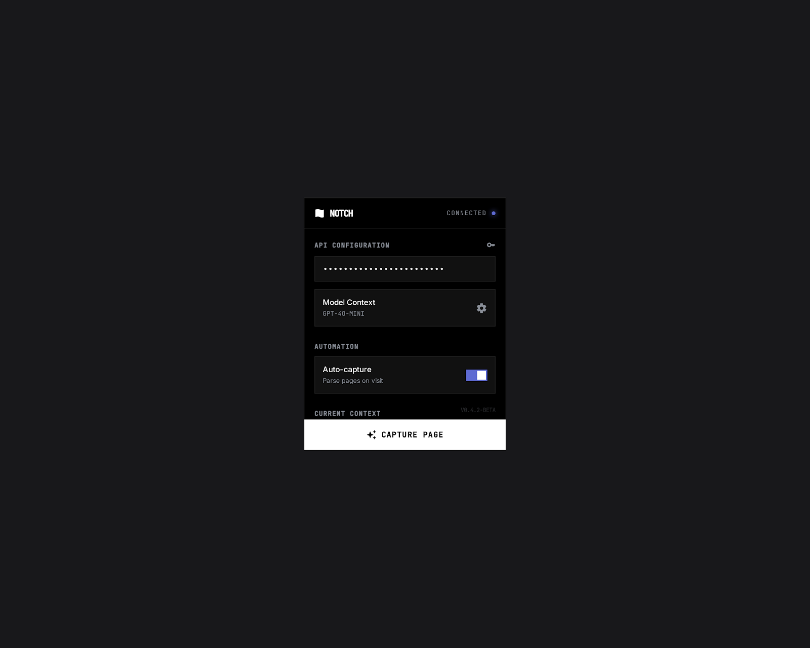

# Notch

A high-density browser extension for capturing, structuring, and interrogating web content. Built for developers, researchers, and students who want a permanent, queryable knowledge base from the web — with full data ownership via a bring-your-own-key (BYOK) model.



---

## What it does

1. **Capture** — Click the extension popup on any page. Notch extracts the content, sends it to Gemini, and returns structured markdown notes with a summary, key entities, timeline, and concepts.
2. **Read** — Open the Reader View for a distraction-free dual-pane layout: original content on the left, AI-generated notes on the right.
3. **Chat** — Switch to the RAG Chat pane to ask questions about the document. Responses include inline citation chips that scroll to the source paragraph.
4. **Library** — Browse, search, filter, and tag all your captured documents from the Library dashboard.

---

## Stack

| Layer | Tech |
|---|---|
| Extension framework | [WXT](https://wxt.dev) |
| UI | React 19 + Tailwind CSS v4 |
| Components | shadcn/ui (Radix primitives) |
| Rich text | Tiptap |
| AI | Google Gemini API (BYOK) |
| Local embeddings | `@huggingface/transformers` + ONNX Runtime (WASM) |
| Storage | Chrome `storage.local` via IndexedDB wrapper |
| Content extraction | `@mozilla/readability` |
| Diagrams | Mermaid + PlantUML |
| Tests | Vitest + fast-check (property-based) |

---

## Generation modes

| Mode | Model | Free quota |
|---|---|---|
| `FAST` | `gemini-3.1-flash-lite-preview` | 500 req/day |
| `BALANCED` | `gemma-3-12b-it` | 14,400 req/day |
| `DEEP` | `gemma-3-27b-it` | 14,400 req/day |

RAG queries always use `BALANCED` to preserve quota.

---

## Getting started

### Prerequisites

- Node.js 18+
- A [Google AI Studio](https://aistudio.google.com/app/apikey) API key (free, no credit card required)

### Install & dev

```bash
npm install
npm run dev          # Chrome
npm run dev:firefox  # Firefox
```

Load the unpacked extension from `.output/chrome-mv3-dev` in `chrome://extensions`.

### Build

```bash
npm run build          # Chrome MV3
npm run build:firefox  # Firefox MV2
npm run zip            # Packaged .zip for the Chrome Web Store
```

### Test

```bash
npm test
```

---

## Configuration

Open the Settings page (via the extension options or the popup) and paste your Google AI Studio API key. Select a default generation mode and save. No other setup is required.

For local/offline inference, Ollama support is wired into the type system and settings schema — endpoint defaults to `http://localhost:11434`.

---

## Project structure

```
src/
  entrypoints/
    popup/       # 320×480px capture UI
    newtab/      # (reserved)
    reader/      # Dual-pane reader + RAG chat
    options/     # Settings & onboarding
    background/  # Service worker — orchestrates capture pipeline
    content/     # DOM extraction injected into pages
  components/
    ChatPanel.tsx
    MermaidBlock.tsx
    PlantUMLBlock.tsx
    UnifiedCodeNodeView.tsx
    ui/          # shadcn/ui primitives
  lib/
    ai-client.ts       # Gemini API calls
    embedding-engine.ts # Local ONNX embeddings
    retrieval.ts       # Cosine similarity RAG
    idb.ts             # IndexedDB helpers
    storage.ts         # chrome.storage wrapper
    export.ts          # Markdown export
    types.ts           # Shared types
```

---

## License

[MIT](LICENSE)
