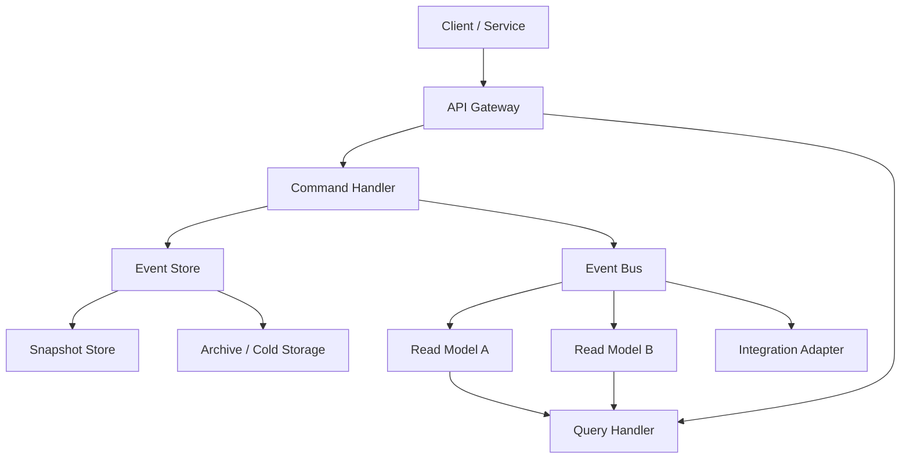
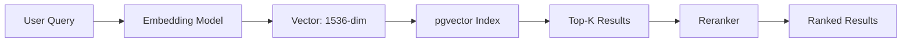
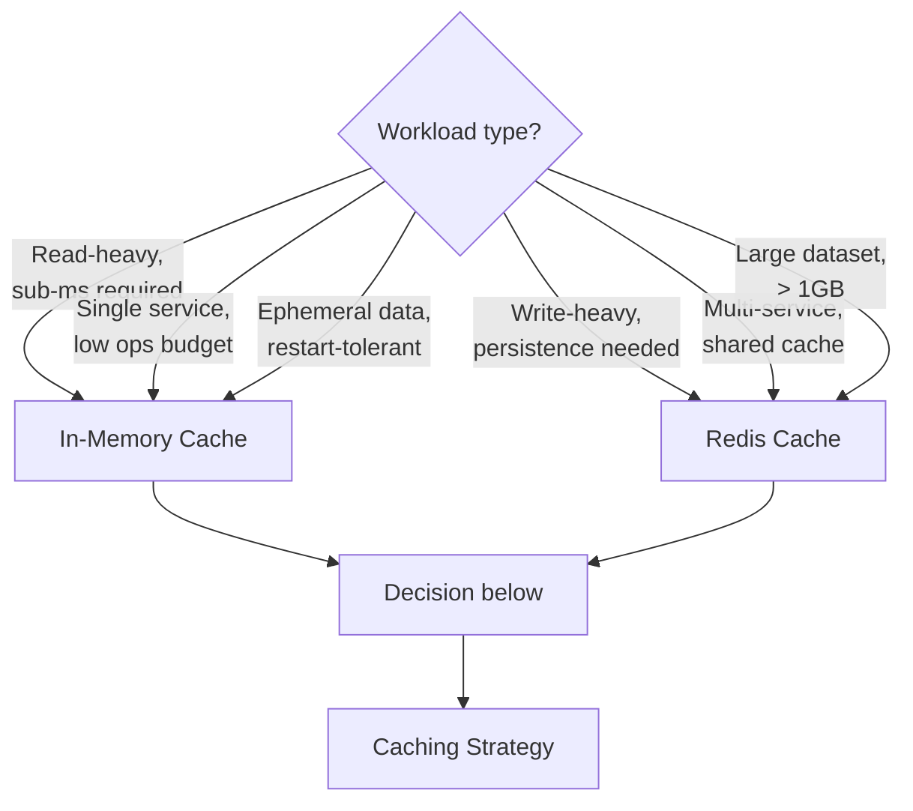

# Example NDL Documents

**Version:** 1.0.0  
**Status:** RFC (Request for Comments)  
**Last Updated:** 2026-07-06  
**Author:** Notch Architectural Committee  
**Applies To:** NDL document generation, validation, and rendering subsystems

---

## Table of Contents

1. [Technical Architecture Document](#1-technical-architecture-document)
2. [Tutorial](#2-tutorial)
3. [Comparison Guide](#3-comparison-guide)

---

## 1. Technical Architecture Document

The following example demonstrates an architecture-class NDL document. It uses a mermaid flowchart for system topology, component breakdown with semantic blocks, API endpoint descriptors, TypeScript code examples, GFM callouts, a reference section, and a file tree.

````markdown
# Event Sourcing Engine: System Architecture

**Version:** 2.1.0  
**Last Updated:** 2026-07-06

## Overview

The Event Sourcing Engine is a write-optimized append-only log system that persists domain events as the primary data source. Read models are derived as materialized projections, enabling temporal query, audit reconstruction, and event-driven integration with downstream consumers.

## Architecture

The system follows a hexagonal architecture with three concentric layers: application core, adapter interfaces, and infrastructure implementations.


````

_Figure 1: System architecture showing the command-query responsibility segregation and event flow._

## Components

### Event Store

The event store is the central append-only log. Events are sequenced by a monotonically increasing global offset and partitioned by aggregate type.

```typescript
// filename: src/event-store/store.ts
interface EventRecord {
  offset: bigint;
  aggregateId: string;
  aggregateType: string;
  version: number;
  eventType: string;
  data: Record<string, unknown>;
  metadata: {
    timestamp: Date;
    causationId: string;
    correlationId: string;
  };
}

class EventStore {
  private stream: EventStream;

  async append(events: EventRecord[]): Promise<void> {
    for (const event of events) {
      await this.stream.write(event);
    }
  }

  async readStream(aggregateId: string, fromVersion: number = 0): Promise<EventRecord[]> {
    return this.stream.scan({
      filter: { aggregateId },
      offset: fromVersion,
    });
  }
}
```

> [!NOTE]
> The `offset` field uses `bigint` to support event sequences exceeding `Number.MAX_SAFE_INTEGER`. All production deployments should verify their database adapter supports 64-bit integer columns.

### Projection Engine

Read models are maintained by the projection engine, which subscribes to the event bus and applies events to materialized views. Each projection is identified by a unique name and maintains its own checkpoint offset.

```typescript
// filename: src/projections/engine.ts
interface Projection {
  name: string;
  checkpoint: bigint;
  handlers: Record<string, (event: EventRecord, tx: Transaction) => Promise<void>>;
}

class ProjectionEngine {
  private projections: Map<string, Projection>;

  async processEvent(event: EventRecord): Promise<void> {
    for (const [, projection] of this.projections) {
      const handler = projection.handlers[event.eventType];
      if (handler) {
        await handler(event, this.currentTx);
      }
    }
    await this.advanceCheckpoints(event.offset);
  }
}
```

### Snapshot Strategy

Snapshots prevent unbounded event stream replay. The system takes a snapshot every 100 events per aggregate and writes the full state to the snapshot store.

| Parameter         | Value             | Notes                              |
| ----------------- | ----------------- | ---------------------------------- |
| Snapshot interval | 100 events        | Configurable per aggregate type    |
| Storage format    | Protocol Buffers  | 40% compaction over JSON           |
| Retention         | 3 most recent     | Enables point-in-time recovery     |
| Compression       | Zstandard level 3 | 5:1 compression ratio on text data |

:::performance
Snapshot read latency averages 2ms for aggregates under 10,000 events. Rebuilding from a snapshot plus remaining events is 12x faster than full replay from the beginning of the stream.
:::

## API Endpoints

### POST /api/v1/events

Appends one or more events to the store. Accepts an array of event envelopes.

```json
{
  "events": [
    {
      "aggregateId": "order-1234",
      "aggregateType": "order",
      "eventType": "OrderPlaced",
      "data": { "total": 2999, "currency": "USD" }
    }
  ]
}
```

**Response:** `202 Accepted` with the assigned offsets.

### GET /api/v1/events/{aggregateId}

Reads the event stream for a specific aggregate. Supports optional `?fromVersion` and `?limit` query parameters.

**Response:**

```json
{
  "aggregateId": "order-1234",
  "events": [
    {
      "offset": "1048576",
      "version": 1,
      "eventType": "OrderPlaced",
      "data": { "total": 2999 },
      "timestamp": "2026-07-06T10:30:00Z"
    }
  ]
}
```

> [!WARNING]
> The event stream is append-only and immutable. Events cannot be deleted or modified after commit. Compensation events must be used to reverse the effects of a previously committed event.

## Project Structure

```tree
event-sourcing-engine/
├── src/
│   ├── event-store/
│   │   ├── store.ts
│   │   ├── stream.ts
│   │   └── serialization.ts
│   ├── projections/
│   │   ├── engine.ts
│   │   ├── registry.ts
│   │   └── projections/
│   │       ├── order-summary.ts
│   │       └── customer-history.ts
│   ├── api/
│   │   ├── routes.ts
│   │   └── middleware.ts
│   └── index.ts
├── tests/
│   ├── unit/
│   └── integration/
├── docker-compose.yml
└── package.json
```

## Key Design Decisions

:::architecture
**Decision:** Use global offset sequencing rather than per-aggregate versioning.

**Context:** The system supports cross-aggregate queries and global event ordering for integration adapters. Per-aggregate sequencing would require coordinating across aggregate boundaries to establish a global order.

**Tradeoff:** Global offsets create a single write bottleneck at the offset allocator. Mitigation uses batched offset reservation (reserve 100 offsets at a time) to reduce allocator contention.
:::

## References

1. [Event Sourcing Pattern (Martin Fowler)](https://martinfowler.com/eaaDev/EventSourcing.html)
2. [CQRS Documentation (Microsoft)](https://docs.microsoft.com/en-us/azure/architecture/patterns/cqrs)
3. [Hexagonal Architecture (Alistair Cockburn)](https://alistair.cockburn.us/hexagonal-architecture/)

````

---

## 2. Tutorial

The following example demonstrates a tutorial-class NDL document. It uses step-by-step instructions, prerequisites, setup commands via terminal blocks, TypeScript code examples, a mermaid diagram for architectural understanding, verification callouts, an accordion for optional deep-dive content, and a file tree for the project layout.

```markdown
# Building a Vector Search Pipeline with pgvector

## Introduction

This tutorial walks through building a semantic search pipeline using PostgreSQL's pgvector extension. By the end, you will have a working API that accepts natural language queries and returns semantically relevant results using cosine similarity.

## Prerequisites

- Node.js 20 or later
- PostgreSQL 15 or later with pgvector extension installed
- Docker (for local PostgreSQL setup)
- An OpenAI API key or compatible embedding provider

> [!IMPORTANT]
> pgvector requires PostgreSQL 15+. Verify your version with `SELECT version();` before proceeding.

## Setup

Start a PostgreSQL instance with pgvector pre-installed:

```terminal
$ docker run -d \
  --name pgvector-db \
  -e POSTGRES_PASSWORD=devpassword \
  -e POSTGRES_DB=vectordb \
  -p 5432:5432 \
  pgvector/pgvector:0.7.0-pg15
e7d92a8c3f1b...
````

Create a new Node.js project and install dependencies:

```terminal
$ mkdir vector-search-demo
$ cd vector-search-demo
$ npm init -y
$ npm install @pgvector/pgvector drizzle-orm postgres dotenv openai
```

## Understanding the Pipeline

The search pipeline transforms text into vector embeddings and performs similarity search against a pre-indexed database.



_Figure 1: Vector search pipeline showing the flow from natural language query to ranked results._

The embedding model converts each text input into a 1536-dimensional floating-point vector. The pgvector index stores these vectors and performs approximate nearest-neighbor (ANN) search using IVFFlat or HNSW indexing.

## Step 1: Database Schema

Define the schema using Drizzle ORM. The `documents` table stores both the raw text and its embedding vector.

```typescript
// filename: src/schema.ts
import { pgTable, serial, text, vector } from 'drizzle-orm/pg-core';

export const documents = pgTable('documents', {
  id: serial('id').primaryKey(),
  title: text('title').notNull(),
  content: text('content').notNull(),
  embedding: vector('embedding', { dimensions: 1536 }),
});
```

Run the migration to create the table:

```terminal
$ npx drizzle-kit push
```

> [!TIP]
> If you already have data in your database, create a separate `documents` table and backfill embeddings incrementally to avoid downtime.

## Step 2: Embedding Client

Create a client that generates embeddings using the OpenAI API.

```typescript
// filename: src/embed.ts
import OpenAI from 'openai';

const openai = new OpenAI({ apiKey: process.env.OPENAI_API_KEY });

export async function generateEmbedding(text: string): Promise<number[]> {
  const response = await openai.embeddings.create({
    model: 'text-embedding-3-small',
    input: text,
  });
  return response.data[0].embedding;
}
```

The `text-embedding-3-small` model returns 1536-dimensional vectors. For cheaper storage, pass `dimensions: 512` to the API to truncate the vector while preserving semantic quality.

## Step 3: Inserting Documents

Build an ingestion function that takes a document and stores both its text and embedding.

```typescript
// filename: src/ingest.ts
import { drizzle } from 'drizzle-orm/postgres-js';
import postgres from 'postgres';
import { documents } from './schema';
import { generateEmbedding } from './embed';

const client = postgres(process.env.DATABASE_URL!);
const db = drizzle(client);

export async function ingestDocument(title: string, content: string) {
  const embedding = await generateEmbedding(content);

  const [doc] = await db
    .insert(documents)
    .values({
      title,
      content,
      embedding,
    })
    .returning();

  return doc;
}
```

## Step 4: Search Query

Implement the vector search function using cosine similarity.

```typescript
// filename: src/search.ts
import { drizzle } from 'drizzle-orm/postgres-js';
import postgres from 'postgres';
import { documents } from './schema';
import { generateEmbedding } from './embed';
import { sql } from 'drizzle-orm';

const client = postgres(process.env.DATABASE_URL!);
const db = drizzle(client);

export async function searchDocuments(query: string, topK: number = 10) {
  const queryVector = await generateEmbedding(query);

  const results = await db
    .select()
    .from(documents)
    .orderBy(sql`embedding <-> ${queryVector}::vector`)
    .limit(topK);

  return results;
}
```

The `<->` operator computes cosine distance. Results are ordered from most similar to least similar.

## Step 5: API Server

Wire everything together with a simple Express server.

```typescript
// filename: src/index.ts
import express from 'express';
import { ingestDocument } from './ingest';
import { searchDocuments } from './search';

const app = express();
app.use(express.json());

app.post('/ingest', async (req, res) => {
  const { title, content } = req.body;
  const doc = await ingestDocument(title, content);
  res.status(201).json(doc);
});

app.get('/search', async (req, res) => {
  const query = req.query.q as string;
  const results = await searchDocuments(query);
  res.json({ results });
});

app.listen(3000, () => console.log('Vector search API on :3000'));
```

## Verification

Run the server and test with sample data:

```terminal
$ curl -X POST http://localhost:3000/ingest \
  -H "Content-Type: application/json" \
  -d '{"title": "PostgreSQL Configuration",
       "content": "Set shared_buffers to 25% of RAM. Configure effective_cache_size to 50% of RAM."}'

$ curl "http://localhost:3000/search?q=database+memory+tuning"
```

```terminal
{
  "results": [
    {
      "id": 1,
      "title": "PostgreSQL Configuration",
      "content": "Set shared_buffers to 25% of RAM...",
      "similarity": 0.912
    }
  ]
}
```

> [!SUCCESS]
> If you receive results with similarity scores above 0.85, the pipeline is working correctly. Try querying with synonyms to test semantic understanding.

## Project Layout

```tree
vector-search-demo/
├── src/
│   ├── schema.ts
│   ├── embed.ts
│   ├── ingest.ts
│   ├── search.ts
│   └── index.ts
├── tests/
│   └── search.test.ts
├── docker-compose.yml
├── package.json
├── tsconfig.json
└── .env
```

## Next Steps

<details>
<summary>Advanced: HNSW Indexing</summary>

For production workloads exceeding 100,000 vectors, switch from IVFFlat to HNSW indexing:

```sql
CREATE INDEX ON documents USING hnsw (embedding vector_cosine_ops);
```

HNSW provides faster search at the cost of longer build times and higher memory usage. Build time scales as `O(n log n)` compared to IVFFlat's `O(n)`.

</details>

## References

1. [pgvector GitHub Repository](https://github.com/pgvector/pgvector)
2. [OpenAI Embedding API Documentation](https://platform.openai.com/docs/guides/embeddings)
3. [Drizzle ORM Documentation](https://orm.drizzle.team)

````

---

## 3. Comparison Guide

The following example demonstrates a compare-class NDL document. It compares two caching strategies using a head-to-head table, detailed analysis per criterion, callouts for pros and cons, a mermaid decision-flow diagram, a recommended approach with justification, equations for complexity analysis, and a reference section.

```markdown
# Redis Cache vs. In-Memory Cache: A Technical Comparison

## Introduction

Caching is the primary strategy for reducing latency in data-intensive applications. This document compares two widely used caching approaches: a dedicated Redis server and an in-process memory cache. The comparison covers performance, consistency, operational complexity, and cost trade-offs to help teams select the appropriate strategy for their workload.

## Options Overview

### Option A: Redis Cache

Redis is a standalone, networked, in-memory data structure server. It runs as an independent process that the application communicates with over TCP or Unix socket.

```terminal
$ docker run -d --name redis-cache -p 6379:6379 redis:7-alpine
f8e9a1b2c3d4...
````

### Option B: In-Memory Cache (Node.js)

An in-memory cache runs within the application process using a library such as `node-cache` or `lru-cache`. Data lives in the same heap as the application.

```typescript
// filename: src/cache/memory.ts
import { LRUCache } from 'lru-cache';

const cache = new LRUCache<string, unknown>({
  max: 5000,
  ttl: 1000 * 60 * 5, // 5 minutes
});

export function get<T>(key: string): T | undefined {
  return cache.get(key) as T | undefined;
}

export function set<T>(key: string, value: T): void {
  cache.set(key, value);
}
```

## Head-to-Head Comparison

| Criterion         | Redis Cache                               | In-Memory Cache                   |
| ----------------- | ----------------------------------------- | --------------------------------- |
| Access latency    | 0.5-2ms (network round trip)              | 0.001-0.1ms (heap access)         |
| Capacity          | Up to RAM limit (GB-TB)                   | Process heap limit (MB-GB)        |
| Persistence       | RDB/AOF snapshots                         | None (lost on restart)            |
| Consistency model | Strong with WAIT                          | Immediate (single process)        |
| Data structures   | Strings, hashes, lists, sets, sorted sets | Key-value only                    |
| Eviction policy   | 8 policies (LRU, LFU, TTL, random)        | Library-dependent (typically LRU) |
| Replication       | Master-replica, Redis Cluster             | Not applicable                    |
| Operational cost  | Dedicated infrastructure                  | Zero (runs in-process)            |
| Failure mode      | Independent (app unaffected if degraded)  | Cascading (OOM kills process)     |
| Monitoring        | Built-in INFO, SLOWLOG, MONITOR           | Application-level instrumentation |

## Detailed Analysis

### Latency

The primary advantage of in-memory caching is latency. Data access requires no serialization, no network hop, and no system call.

$$
L_{redis} = L_{serialize} + L_{network} + L_{redis\_lookup} + L_{deserialize}
$$

$$
L_{memory} = L_{heap\_lookup}
$$

Typical values: `L_redis` ranges from 0.5ms to 2ms depending on network conditions. `L_memory` is consistently under 0.1ms. For workloads requiring sub-millisecond p99 latency, in-memory caching is strongly preferred.

> [!NOTE]
> The latency gap narrows when using Unix sockets (Redis) instead of TCP. Unix socket access reduces network overhead by approximately 0.3ms.

### Consistency

Both approaches offer strong consistency within a single node. The difference emerges in distributed topologies:

| Consistency Aspect     | Redis                   | In-Memory      |
| ---------------------- | ----------------------- | -------------- |
| Read-after-write       | Immediate (single node) | Immediate      |
| Cross-node consistency | Eventual (replica lag)  | Not applicable |
| Stale read window      | 0-100ms (typical)       | 0ms            |
| Split-brain risk       | Present (cluster mode)  | Not applicable |

### Operational Complexity

Redis introduces operational burden that in-memory caching avoids entirely:

> [!WARNING] Redis Operational Costs
>
> - Requires dedicated infrastructure provisioning and monitoring.
> - Connection pool management adds application complexity.
> - Network partitions can cause cache stampedes if connection fails.
> - Backup and restore procedures must be tested regularly.

In-memory caches eliminate these concerns but introduce application-level risks:

> [!CAUTION] In-Memory Cache Risks
>
> - Cache growth can exhaust heap memory, causing process termination.
> - No data sharing across process instances — each node maintains its own cache.
> - Cache is lost on every deployment restart, causing a cold-start period.

### Memory Efficiency

Redis stores data in its own allocator (jemalloc) optimized for the Redis data model. In-memory caches share the Node.js heap, competing with application objects for garbage collection cycles.



_Figure 1: Decision flow chart guiding cache selection based on workload characteristics._

## Recommendation

### Choose Redis When

- Multiple application instances need a shared, consistent cache.
- The dataset exceeds available heap memory (greater than 1GB).
- Data must survive application restarts or be replicated across regions.
- The cache needs advanced data structures beyond simple key-value storage.

### Choose In-Memory When

- Sub-millisecond latency is a hard requirement (p99 under 0.5ms).
- Operational budget is constrained (no dedicated infrastructure team).
- The application is single-instance or uses session-affinity routing.
- Cache loss on restart is acceptable (warm-up time is tolerable).

### Decision Matrix

| Scenario                            | Recommended | Rationale                            |
| ----------------------------------- | ----------- | ------------------------------------ |
| High-frequency reads, single node   | In-Memory   | 10x latency improvement at zero ops  |
| Shared cache across microservices   | Redis       | Single source of truth               |
| Session store for web application   | Redis       | Persistence and failover             |
| Database query result cache (large) | Redis       | Memory capacity, eviction policies   |
| Compute-intensive memoization       | In-Memory   | Latency critical, scoped to process  |
| Rate limiting counters              | Redis       | TTL-based counters, atomic increment |

:::architecture
**Recommendation:** Use a hybrid approach. Deploy an in-memory L1 cache for hot data (sub-millisecond access) backed by a Redis L2 cache for shared, persistent, and large-volume data. The L1 cache serves 80% of reads while the L2 cache handles coherence across nodes.

```
Request → L1 (in-memory) → L2 (Redis) → Database
```

Cache-aside pattern with write-through to Redis and background refresh of L1 from L2 provides the optimal balance of latency, consistency, and resource utilization.
:::

## References

1. [Redis Documentation: Persistence](https://redis.io/docs/latest/operate/oss_and_stack/management/persistence/)
2. [lru-cache npm Package](https://www.npmjs.com/package/lru-cache)
3. [Cache-Aside Pattern (Microsoft)](https://docs.microsoft.com/en-us/azure/architecture/patterns/cache-aside)
4. [Redis vs. Memcached: In-Memory Cache Comparison](https://example.com/redis-vs-memcached)

```

```
