# Notch Document Language (NDL) Specification

**Version:** 1.0.0
**Status:** RFC (Request for Comments)
**Last Updated:** 2026-07-06
**Author:** Notch Architectural Committee
**Applies To:** All document generation, parsing, validation, rendering, and export subsystems

---

## Table of Contents

1. [Introduction](#1-introduction)
2. [Design Goals](#2-design-goals)
3. [Syntax Reference](#3-syntax-reference)
4. [Grammar (Informal BNF)](#4-grammar-informal-bnf)
5. [Parsing Rules](#5-parsing-rules)
6. [Examples](#6-examples)

---

## 1. Introduction

The Notch Document Language (NDL) is a markdown-compatible superset designed as the canonical document format for the Notch knowledge capture and rendering system. NDL extends standard CommonMark with typed semantic blocks, GFM-style callouts, Mermaid and PlantUML diagrams, KaTeX equations, media embeds, reference sections, terminal sessions, file trees, accordion panels, and API endpoint descriptors.

NDL serves as both the serialization format produced by AI models (via the generation pipeline) and the input format consumed by the NDL parser, which produces a strictly typed AST. The AST is then validated, transformed, and rendered by the Notch Reader. NDL is designed to be human-readable in raw form, model-agnostic across AI providers, and capable of lossless round-trip conversion between markdown and the typed AST.

### 1.1 Scope

- **In scope:** All syntactic constructs described in this specification, their canonical markdown representation, parsing rules, and informal grammar.
- **Out of scope:** AST type definitions (see [AST Specification](./AST_SPECIFICATION.md)), AI provider generation behavior (see [Document Generation Specification](./NOTCH_DOCUMENT_GENERATION_SPECIFICATION.md)), renderer implementation details (see [Renderer Specification](./RENDERER_SPECIFICATION.md)), and validation rules (see [Validation Specification](./VALIDATION_SPECIFICATION.md)).

### 1.2 Document Pipeline Context

```
Markdown / NDL (from AI model or author)
    |
    v
NDL Parser (marked lexer -> typed AST nodes)
    |
    v
NDL Validator (structure, content, consistency)
    |
    v
NDL Transformers (normalization, enrichment)
    |
    v
Document Renderer (React components per node type)
    |
    v
Reader / PDF Export / Markdown Export
```

---

## 2. Design Goals

### 2.1 Markdown-Compatible

NDL is a strict superset of CommonMark. Every valid CommonMark document is a valid NDL document. NDL constructs use syntax that degrades gracefully in standard markdown renderers: callouts render as blockquotes, diagrams render as code blocks, and semantic blocks render as fenced containers.

### 2.2 Human-Readable

NDL documents are readable and editable in any text editor without specialized tooling. Syntax is chosen to be visually scannable: callout markers are readable English words, semantic fence kinds describe their content, and diagram blocks are self-contained.

### 2.3 Model-Agnostic

NDL imposes no requirements on which AI model produced the document. All model-specific quirks (language aliases, formatting inconsistencies, structural deviations) are normalized during parsing. The same NDL input, regardless of provenance, produces an identical AST.

### 2.4 Lossless Round-Trip

The NDL parser preserves all source content. The markdown exporter (`exportToMarkdown`) can reconstruct semantically equivalent NDL from the AST with no information loss. Every paragraph retains its raw text, every code block retains its content, and every semantic block retains its inner HTML representation.

### 2.5 Deterministic Parsing

Given the same input, the NDL parser always produces the same AST. Disambiguation rules (callout detection in blockquotes, diagram detection in code blocks, math detection in paragraphs) are applied in a fixed, documented order with no heuristics or model-specific branching.

### 2.6 Extensible via New Node Types

New constructs are added by defining a new AST node type, implementing the parser branch (usually via a code fence or paragraph pattern), adding validator rules, and implementing a renderer component. No existing code requires modification beyond these four extension points.

---

## 3. Syntax Reference

### 3.1 Standard Markdown

NDL supports all standard CommonMark constructs. These are parsed by the underlying `marked` lexer and mapped to their corresponding AST node types.

**Headings:**

```markdown
# Level 1 Heading

## Level 2 Heading

### Level 3 Heading

#### Level 4 Heading

##### Level 5 Heading

###### Level 6 Heading
```

Headings produce `HeadingNode` with `level` (1-6), `text`, and an auto-generated `id` for anchor linking. Section numbering is computed during hierarchy construction.

**Paragraphs:**

```markdown
This is a paragraph of text. It may contain **bold**, _italic_, `code`, and [links](https://example.com).

This is another paragraph separated by a blank line.
```

Paragraphs produce `ParagraphNode` with the raw markdown preserved in the `raw` field and an HTML-rendered version in the `html` field.

**Unordered Lists:**

```markdown
- Item one
- Item two
- Item three
  - Nested item
  - Nested item
```

**Ordered Lists:**

```markdown
1. First item
2. Second item
3. Third item
```

Lists produce `ListNode` with `ordered` (boolean), `items` (array of `ListItem`), and optional `start` for ordered lists.

**Blockquotes:**

```markdown
> This is a blockquote.
> It spans multiple lines.
```

Blockquotes that do not match the callout pattern (see 3.2) produce `BlockquoteNode` with the raw markdown preserved.

**Tables:**

```markdown
| Header 1 | Header 2 | Header 3 |
| -------- | :------: | -------: |
| Left     |  Center  |    Right |
| Cell     |   Cell   |     Cell |
```

Tables produce `TableNode` with `columns` (header text and alignment per column) and `rows` (array of string arrays). The NDL parser captures alignment specifiers (`left`, `center`, `right`) from the separator row.

**Images:**

```markdown

```

Standalone image syntax (a paragraph containing only an image) produces `ImageNode` with `url` and `alt`. Images inline within paragraphs are preserved as part of the paragraph HTML.

**Links:**

```markdown
[Link text](https://example.com)
```

Links are preserved inline within paragraph HTML. They do not produce standalone AST nodes.

**Horizontal Rules:**

```markdown
---
```

Horizontal rules produce `ThematicBreakNode`.

**Code Fences (non-diagram):**

````markdown
```python
def hello():
    print("Hello, world!")
```
````

````

Code fences with a recognized programming language identifier produce `CodeNode` with `language`, `content`, and `showLineNumbers` (default `true`). Language identifiers are normalized: `js` becomes `javascript`, `py` becomes `python`, `sh` becomes `bash`, etc.

### 3.2 GFM Callouts

NDL extends standard blockquotes with GitHub Flavored Markdown callout syntax. Callouts are detected when a blockquote paragraph begins with `> [!KIND]`.

```markdown
> [!NOTE] Optional title
> Content of the note callout.

> [!WARNING]
> This is a warning callout.
> It can span multiple lines.

> [!TIP]
> A helpful tip for the reader.

> [!DANGER]
> This indicates a critical hazard.

> [!INFO]
> Informational content.

> [!IMPORTANT]
> Key information the reader should not miss.

> [!CAUTION]
> Advises about risks or negative consequences.

> [!SUCCESS]
> Indicates a successful outcome or positive result.

> [!QUESTION]
> Poses a question or prompts consideration.
````

Supported callout kinds: `NOTE`, `WARNING`, `TIP`, `DANGER`, `INFO`, `IMPORTANT`, `CAUTION`, `SUCCESS`, `QUESTION`.

Callouts produce `CalloutNode` with:

- `kind`: The normalized kind string (lowercase).
- `title`: Optional text after the kind marker on the first line.
- `html`: The remaining content (all lines after the first) rendered as HTML.

If a callout's content contains a Mermaid diagram (detected via first-line pattern matching), the parser extracts the diagram as a separate `DiagramNode` and retains any remaining text in the callout. This enables callout-wrapped diagrams.

### 3.3 Mermaid Diagrams

NDL supports Mermaid diagrams via fenced code blocks with the `mermaid` language identifier.

````markdown
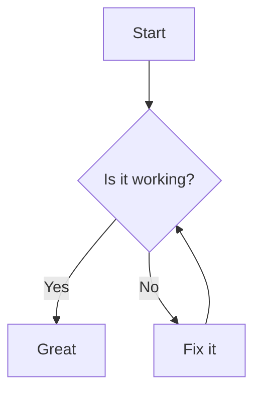
````

````

The parser detects Mermaid blocks by checking the language identifier against a known set of Mermaid aliases (`mermaid`, `flowchart`, `sequencediagram`, `classdiagram`, `statediagram`, `erdiagram`, `journey`, `gantt`, `pie`, `mindmap`, `timeline`, `gitgraph`, `quadrantchart`, `zenuml`). It also inspects the first line of content to determine the diagram kind.

Supported diagram kinds:

```markdown
```mermaid
sequenceDiagram
    Alice->>John: Hello John, how are you?
    John-->>Alice: Great!
````

```mermaid
classDiagram
    class Animal {
        +String name
        +makeSound()
    }
```

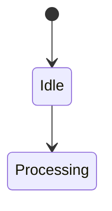

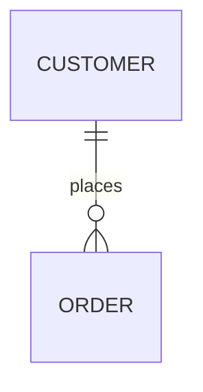

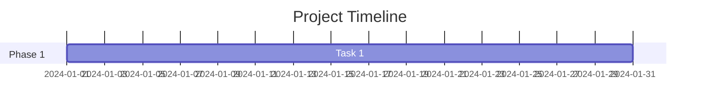

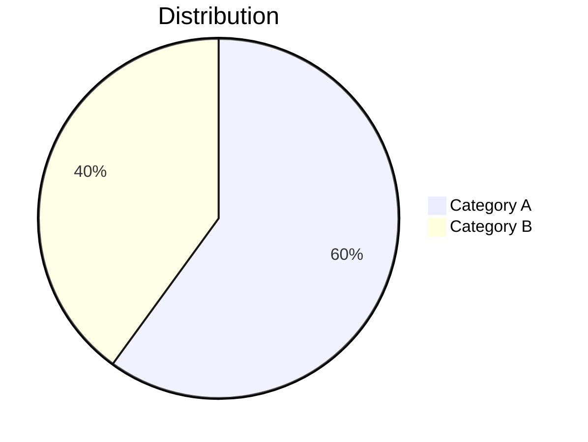

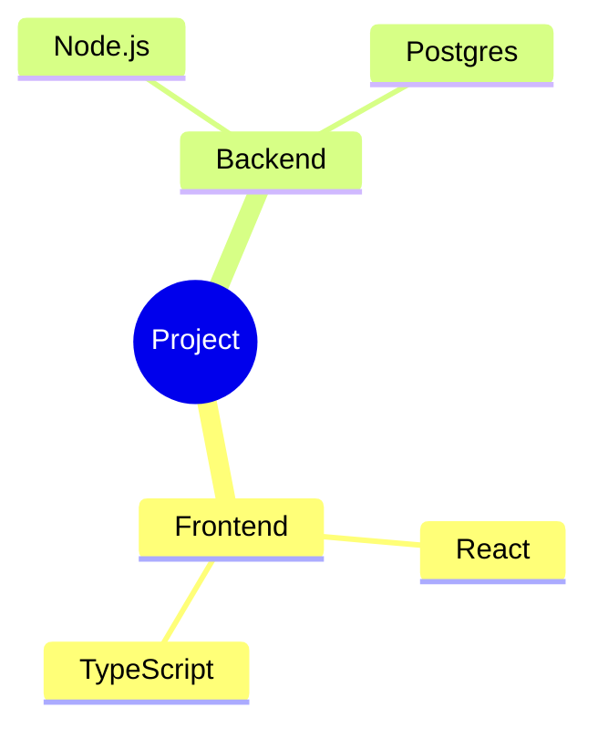

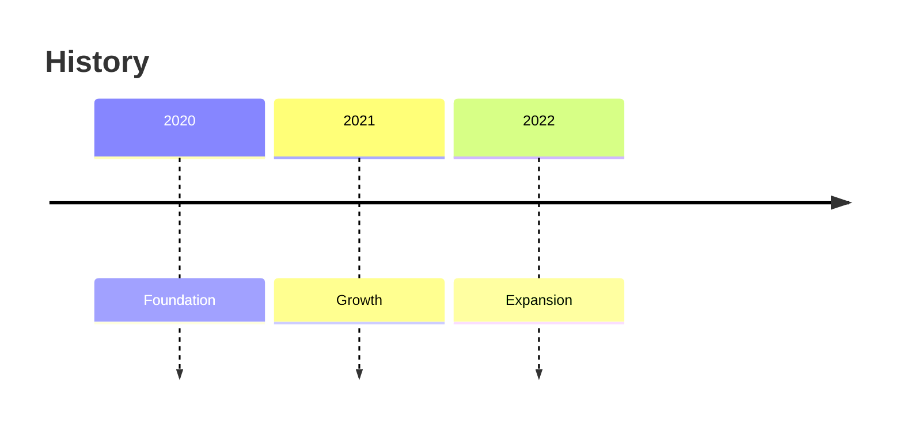

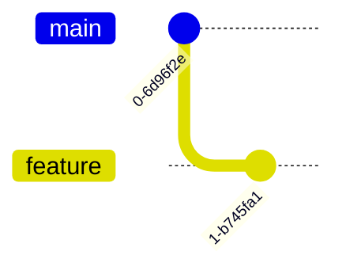

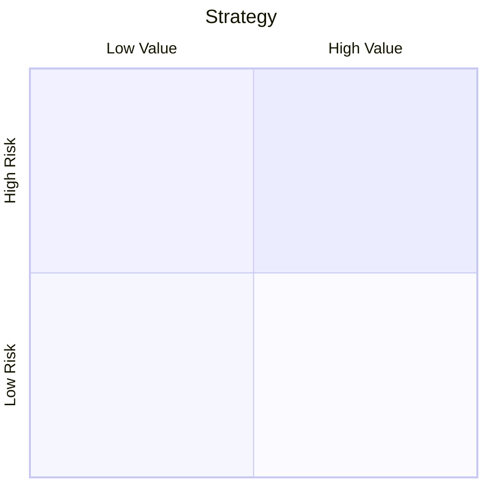

Mermaid blocks produce `DiagramNode` with `engine: 'mermaid'`, `kind` (the detected diagram type), and `content` (the raw diagram source).

### 3.4 PlantUML Diagrams

NDL supports PlantUML diagrams via fenced code blocks with the `plantuml` language identifier.

````markdown
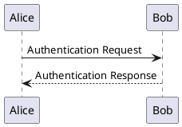
````

````

PlantUML blocks produce `DiagramNode` with `engine: 'plantuml'` and `kind: 'plantuml'`.

### 3.5 Math and Equations

NDL supports KaTeX equations in both display and inline modes.

**Display Equations:**

```markdown
$$
E = mc^2
$$

$$
\int_{-\infty}^{\infty} e^{-x^2} \, dx = \sqrt{\pi}
$$
````

Display equations use double dollar sign delimiters on their own lines. They produce `EquationNode` with `content` (the equation source) and `displayMode: true`.

**Inline Equations:**

```markdown
The energy-mass equivalence is given by $E = mc^2$, where $c$ is the speed of light.
```

Inline equations use single dollar sign delimiters within paragraph text. They are preserved as part of the paragraph HTML with math rendered by the KaTeX library. The parser does not extract inline equations into separate nodes; they remain embedded in `ParagraphNode.html`.

### 3.6 Media Embeds

NDL supports media embeds via a custom `@[provider](url)` syntax within paragraphs.

```markdown
@[youtube](https://www.youtube.com/watch?v=dQw4w9WgXcQ)

@[vimeo](https://vimeo.com/123456789)

@[video](https://example.com/video.mp4)

@[audio](https://example.com/podcast.mp3)

@[pdf](https://example.com/document.pdf)
```

When a paragraph consists solely of a media embed, it produces `VideoNode` with:

- `provider`: One of `youtube`, `vimeo`, `html5`, `audio`, `pdf`, `iframe`.
- `url`: The embed URL.

Media embeds inline within other paragraph text are preserved within the paragraph HTML.

### 3.7 Semantic Blocks

NDL supports semantic fenced blocks using triple-colon fences. These are used to group content under a typed semantic label.

```markdown
::: architecture
The system follows a microservices architecture with the following components:

- API Gateway
- Service Mesh
- Event Bus
  :::

::: security
All data is encrypted at rest using AES-256.

Keys are rotated every 90 days.
:::

::: performance
Benchmark results show a 40% improvement over the baseline.
:::

::: api
The REST API exposes the following endpoints...
:::

::: example
Here is a concrete example of the pattern in use.
:::

::: definition
**Term:** A specific concept
**Meaning:** The precise definition
:::

::: history
This feature was first introduced in version 2.0.
:::

::: future-work
Planned improvements for the next release cycle.
:::

::: timeline

- 2024 Q1: Initial research
- 2024 Q2: Prototype
- 2024 Q3: Production release
  :::
```

Supported semantic block kinds: `architecture`, `performance`, `security`, `api`, `example`, `history`, `future-work`, `timeline`, `definition`.

Semantic blocks produce `SemanticBlockNode` with `kind`, optional `title`, and `html` (the inner content rendered as HTML).

### 3.8 Terminal Sessions

NDL supports terminal session blocks using fenced code blocks with the `terminal` language identifier.

````markdown
```terminal
$ git clone https://github.com/example/project.git
Cloning into 'project'...
remote: Counting objects: 100% (50/50), done.
$ cd project
$ npm install
npm notice created a lockfile as package-lock.json
$ npm run dev
> project@1.0.0 dev
> vite

  VITE ready on http://localhost:5173
```
````

````

Lines beginning with `$` are treated as command input. Lines without a `$` prefix are treated as command output. The parser groups consecutive input/output lines into `TerminalLine` objects with optional `prompt`, `input`, and `output` fields.

Terminal blocks produce `TerminalNode` with `lines` (array of `TerminalLine`) and optional `sessionName`.

### 3.9 File Trees

NDL supports file tree representations using indented list entries with trailing `/` for directories. File trees are detected within fenced code blocks with the `tree` or `filetree` language identifier.

```markdown
```tree
project/
├── src/
│   ├── index.ts
│   ├── components/
│   │   ├── Header.tsx
│   │   └── Footer.tsx
│   └── utils/
│       └── helpers.ts
├── tests/
│   └── index.test.ts
├── package.json
└── README.md
````

````

```markdown
```filetree
docs/
    specifications/
        AST_SPECIFICATION.md
        NDL_SPECIFICATION.md
    README.md
````

````

File tree blocks produce `FileTreeNode` with `entries` (recursive `FileTreeEntry[]`) and optional `rootLabel`.

### 3.10 Accordions

NDL supports collapsible accordion panels using standard HTML `<details>` and `<summary>` tags.

```markdown
<details>
<summary>Click to expand</summary>

This content is hidden by default.

It can contain **markdown** formatted text.

```python
print("Code blocks work inside accordions too")
````

</details>
```

Nested accordions:

```markdown
<details>
<summary>Outer Section</summary>

Content for the outer section.

<details>
<summary>Inner Section</summary>

Content for the inner section.
</details>

</details>
```

Accordions produce `AccordionNode` with `panels` (array of `AccordionPanel`, each with `title` and `content`). The parser preserves the inner content as raw HTML/markdown.

### 3.11 API Endpoints

NDL supports API endpoint descriptors using a `### METHOD /path` heading format. These are typically grouped under a semantic block.

````markdown
### GET /api/v1/users

Retrieves a paginated list of users.

**Parameters:**

- `page` (query, integer): Page number
- `limit` (query, integer): Items per page

**Response:**

```json
{
  "data": [...],
  "total": 100,
  "page": 1
}
```
````

### POST /api/v1/users

Creates a new user.

**Request Body:**

```json
{
  "name": "string",
  "email": "string"
}
```

**Response:** `201 Created`

````

The API heading pattern is `### METHOD /path` where METHOD is one of: `GET`, `POST`, `PUT`, `PATCH`, `DELETE`, `HEAD`, `OPTIONS`.

API endpoint headings produce `ApiNode` with `endpoints` (array of `ApiEndpoint`, each with `method`, `path`, `description`, optional `requestBody`, and optional `responseBody`).

### 3.12 References

NDL supports reference sections using numbered list items with URLs.

```markdown
1. [CommonMark Specification](https://spec.commonmark.org/)
2. [GFM Callouts Discussion](https://github.com/orgs/community/discussions/16925)
3. [Mermaid Documentation](https://mermaid.js.org/)
4. [KaTeX Documentation](https://katex.org/)
````

A reference section is typically placed at the end of a document under a heading such as `## References` or `## Further Reading`. References produce `ReferenceNode` with `items` (array of `ReferenceItem`, each with `id`, `text`, and optional `url`).

---

## 4. Grammar (Informal BNF)

The following is an informal BNF description of the key NDL constructs. Terminal symbols are shown in quotes. Optional elements are in brackets `[...]`. Repetition is indicated with `*` (zero or more) or `+` (one or more).

````
document      ::= block*

block         ::= heading
                | paragraph
                | list
                | code_block
                | diagram_block
                | terminal_block
                | filetree_block
                | callout_block
                | blockquote
                | table
                | thematic_break
                | math_block
                | semantic_block
                | accordion_block
                | reference_section
                | api_endpoint

(* Standard Markdown *)

heading       ::= '#'{1,6} SPACE text newline
paragraph     ::= inline+ (newline inline+)*
list          ::= unordered_list | ordered_list
unordered_list ::= ('-' | '*' | '+') SPACE inline newline
ordered_list ::= digit+ '.' SPACE inline newline
blockquote    ::= '>' SPACE inline newline ('>' SPACE inline newline)*
table         ::= header_row separator_row data_row+
header_row    ::= '|' cell+ '|'
separator_row ::= '|' align_spec+ '|'
data_row      ::= '|' cell+ '|'
thematic_break ::= '---' newline

(* Code Blocks *)

code_block    ::= '```' language newline content '```' newline
language      ::= identifier  (* 'python', 'javascript', 'bash', etc. *)

(* Diagrams *)

diagram_block ::= '```' diagram_lang newline diagram_content '```' newline
diagram_lang  ::= 'mermaid' | 'flowchart' | 'sequencediagram'
                | 'classdiagram' | 'statediagram' | 'erdiagram'
                | 'journey' | 'gantt' | 'pie' | 'mindmap'
                | 'timeline' | 'gitgraph' | 'quadrantchart'
                | 'zenuml' | 'plantuml'
diagram_content ::= diagram_line+

(* Math *)

math_block    ::= '$$' newline equation_content '$$' newline
inline_math   ::= '$' equation_content '$'

(* Callouts *)

callout_block ::= '> ' '[!' kind ']' [SPACE title] newline
                  ('>' SPACE content_line)* newline
kind          ::= 'NOTE' | 'WARNING' | 'TIP' | 'DANGER' | 'INFO'
                | 'IMPORTANT' | 'CAUTION' | 'SUCCESS' | 'QUESTION'

(* Media Embeds *)

media_embed   ::= '@[' provider ']' '(' url ')'
provider      ::= 'youtube' | 'vimeo' | 'video' | 'audio' | 'pdf'

(* Semantic Blocks *)

semantic_block ::= ':::' semantic_kind newline
                   content_line*
                   ':::' newline
semantic_kind ::= 'architecture' | 'performance' | 'security'
                | 'api' | 'example' | 'history' | 'future-work'
                | 'timeline' | 'definition'

(* Terminal Sessions *)

terminal_block ::= '```' 'terminal' newline
                   terminal_line+
                   '```' newline
terminal_line ::= '$' input_line newline [output_line*]
output_line   ::= text newline

(* File Trees *)

filetree_block ::= '```' ('tree' | 'filetree') newline
                   tree_entry+
                   '```' newline
tree_entry    ::= indent name ['/'] newline

(* Accordions *)

accordion_block ::= '<details>' newline
                    '<summary>' title '</summary>' newline
                    content*
                    '</details>' newline

(* API Endpoints *)

api_endpoint  ::= heading_3 METHOD SPACE path newline
                  description*
METHOD        ::= 'GET' | 'POST' | 'PUT' | 'PATCH'
                | 'DELETE' | 'HEAD' | 'OPTIONS'
path          ::= '/' path_segment ('/' path_segment)*

(* References *)

reference_section ::= reference_item+
reference_item ::= digit+ '.' SPACE '[' text ']' '(' url ')'

(* Primitives *)

text          ::= character+
inline        ::= text | bold | italic | code | link | image | inline_math
bold          ::= '**' text '**'
italic        ::= '*' text '*'
code          ::= '`' text '`'
link          ::= '[' text ']' '(' url ')'
image         ::= '![' alt ']' '(' url ')'
url           ::= scheme '://' authority path
newline       ::= '\n'
SPACE         ::= ' '
````

---

## 5. Parsing Rules

The NDL parser operates on the output of the `marked` lexer, which produces a flat token stream. The parser transforms these tokens into typed AST nodes using the following disambiguation rules, applied in order.

### 5.1 Callout Detection in Blockquotes

**Rule:** When the lexer produces a `blockquote` token, the parser inspects the first content line (after stripping the `>` prefix) for the pattern `[!KIND]`. If the pattern matches and the kind is one of the nine recognized callout kinds, the token is transformed into a `CalloutNode` instead of a `BlockquoteNode`.

**Pattern:** `/^\[!(NOTE|WARNING|TIP|DANGER|INFO|IMPORTANT|CAUTION|SUCCESS|QUESTION)\]\s*(.*)?$/i`

**Disambiguation:** The pattern is case-insensitive. The kind lookup is case-normalized to uppercase before mapping to the canonical lowercase kind string. If the pattern does not match, the token remains a `BlockquoteNode`.

### 5.2 Diagram Detection in Code Blocks

**Rule:** When the lexer produces a `code` token, the parser inspects the language identifier. If the language is `mermaid`, `plantuml`, or one of the recognized Mermaid aliases (`flowchart`, `sequencediagram`, `classdiagram`, `statediagram`, `erdiagram`, `journey`, `gantt`, `pie`, `mindmap`, `timeline`, `gitgraph`, `quadrantchart`, `zenuml`), the token is transformed into a `DiagramNode`.

**Sub-rule (Mermaid):** For Mermaid blocks, the parser inspects the first line of content to determine the diagram kind using the pattern:

```
/^(graph\s+(TB|TD|BT|RL|LR)|flowchart\s+(TB|TD|BT|RL|LR)|sequenceDiagram|classDiagram|stateDiagram|erDiagram|journey|gantt|pie|mindmap|timeline|gitGraph|quadrantChart|zenuml|architecture)\b/i
```

If the first line matches, the diagram kind is extracted and mapped to the canonical kind string. If no match, the kind defaults to `'flowchart'`.

**Sub-rule (PlantUML):** Blocks with language `plantuml` are always `DiagramNode` with `engine: 'plantuml'` and `kind: 'plantuml'`.

**Fallback:** If the language identifier is not a diagram language and not empty, the token becomes a `CodeNode` with normalized language. If the language is empty or unrecognized, it becomes a `CodeNode` with `language: 'text'`.

### 5.3 Terminal Session Detection

**Rule:** Code blocks with the language identifier `terminal` are transformed into `TerminalNode`. The content is parsed line-by-line: lines beginning with `$` (optionally preceded by a prompt string) are command inputs; subsequent lines without `$` are outputs.

### 5.4 File Tree Detection

**Rule:** Code blocks with the language identifier `tree` or `filetree` are transformed into `FileTreeNode`. The content is parsed as an indented tree structure where entries ending in `/` are directories and entries without `/` are files. Indentation depth determines parent-child relationships.

### 5.5 Math Detection via Delimiters

**Rule (display math):** The lexer produces paragraph tokens. The parser checks each paragraph's raw text for the pattern `$$...$$` spanning the entire paragraph (possibly with leading/trailing whitespace). If matched, the token becomes an `EquationNode` with `displayMode: true`.

**Rule (inline math):** Inline math `$...$` is detected within paragraph text by the `renderMath` utility function during HTML rendering. Inline equations are not extracted into separate AST nodes; they remain embedded in `ParagraphNode.html`.

**Pattern (display):** `/^\$\$[\s\S]*?\$\$$/`

### 5.6 Media Embed Detection

**Rule:** When the parser encounters a paragraph token whose trimmed content matches the media embed pattern:

```
/^@\[(youtube|vimeo|video|audio|pdf)\]\(([^)]+)\)$/
```

...the token is transformed into a `VideoNode` with the extracted provider and URL. Multi-line paragraphs containing media embeds in the middle of text are not extracted; the embed remains inline within the paragraph HTML.

### 5.7 Semantic Fence Detection

**Rule:** The `marked` lexer does not natively recognize `:::` fences. When the lexer encounters text between `:::` markers, it produces a series of paragraph and code tokens. The parser does not currently extract standalone semantic blocks at the AST level; semantic blocks are currently handled by post-processing or by convention in the generation prompt.

**Future Rule (planned):** A pre-lexer scanning pass will identify `:::` fence pairs, extract the semantic kind from the opening fence, and feed the inner content as a distinct token stream for recursive parsing.

### 5.8 Accordion Detection

**Rule:** HTML `<details>` and `<summary>` tags are passed through by the `marked` lexer. They remain embedded within the parent paragraph's HTML content. The AST currently does not extract accordion panels into separate `AccordionNode` instances; rendering of accordions is handled at the HTML renderer level.

**Future Rule (planned):** A post-parse pass will scan `ParagraphNode.html` for `<details>` structures and extract them into `AccordionNode` instances.

### 5.9 API Endpoint Detection

**Rule:** The parser checks heading tokens for the pattern `### METHOD /path`. If a level-3 heading matches:

```
/^###\s+(GET|POST|PUT|PATCH|DELETE|HEAD|OPTIONS)\s+(\/\S+)/
```

...the heading and its subsequent paragraph content are transformed into an `ApiNode` with the extracted `method` and `path`. The description is taken from the following paragraph(s) until the next heading or block boundary.

### 5.10 Reference Section Detection

**Rule:** A list token whose items are all numbered and contain link syntax (`[text](url)`) is transformed into a `ReferenceNode`. This typically occurs under a heading titled "References", "Further Reading", "Bibliography", or similar. The detection is heuristic: if every item in the list matches the pattern `/^\d+\.\s+\[.+\]\(.+\)$/`, the list is promoted to a reference section.

### 5.11 Inline Diagram Detection in Callouts

**Rule:** After a callout is extracted, its content is scanned for inline diagram patterns. If the callout's HTML content starts with a Mermaid first-line pattern (see 5.2), the diagram is extracted as a separate `DiagramNode` and the remaining callout content (if any) is retained as a `CalloutNode`. This enables callout-wrapped diagram blocks.

### 5.12 Heading Hierarchy Construction

**Rule:** After all tokens are transformed to AST nodes, a post-processing pass constructs a heading hierarchy. Headings are nested according to their level: a level-3 heading becomes a child of the nearest preceding level-2 heading, which becomes a child of the nearest preceding level-1 heading. This hierarchy is stored in `DocumentAST.hierarchy.toc`. Section numbers are assigned via depth-first traversal: `1`, `1.1`, `1.1.1`, `2`, `2.1`, etc.

### 5.13 Disambiguation Order Summary

For each token, the parser applies the following checks in order:

1. Is it a `heading`? Check for API endpoint pattern (level 3 only).
2. Is it a `code` block? Check for diagram, terminal, or file tree language.
3. Is it a `blockquote`? Check for callout pattern.
4. Is it a `paragraph`? Check for media embed, display math, or standalone image.
5. Is it a `list`? Check for reference pattern.
6. Otherwise, map directly to the corresponding AST node type.

---

## 6. Examples

### 6.1 Example: Software Architecture Document

````markdown
# Payment System Architecture

## Overview

The Payment System is a microservices-based platform that processes transactions at scale.

## Architecture Diagram

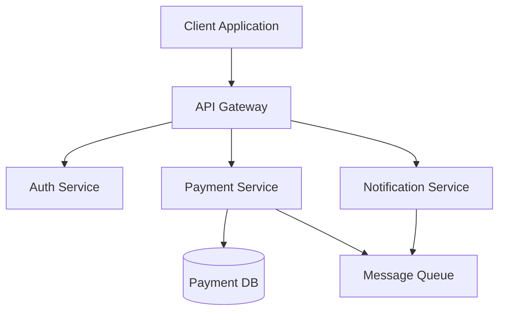
````

## Core Services

### API Gateway

The gateway handles request routing, rate limiting, and authentication.

> [!NOTE]
> The gateway uses a circuit breaker pattern to handle service failures gracefully.

### Payment Service

Processes transactions through a multi-step pipeline.

1. Validate transaction data
2. Check account balance
3. Process payment through provider
4. Update transaction status

> [!WARNING]
> Transactions in `PENDING` state for more than 5 minutes should be flagged for manual review.

## Performance Benchmarks

::: performance
Latency measurements under normal load:

| Endpoint         | p50  |  p95  |  p99  |
| ---------------- | :--: | :---: | :---: |
| /api/v1/payments | 45ms | 120ms | 250ms |
| /api/v1/refunds  | 60ms | 180ms | 350ms |
| :::              |

## Deployment

```bash
# Deploy the payment service
kubectl apply -f k8s/payment-service.yaml

# Verify deployment
kubectl get pods -n payment
```

## References

1. [Microservices Pattern: Circuit Breaker](https://example.com/circuit-breaker)
2. [Payment Processing Best Practices](https://example.com/payment-best-practices)

````

### 6.2 Example: Tutorial with Terminal and Callouts

```markdown
# Building a REST API with Express

## Prerequisites

- Node.js 18 or later
- npm 9 or later
- Basic JavaScript knowledge

## Setup

Create a new project and install dependencies.

```terminal
$ mkdir my-api
$ cd my-api
$ npm init -y
Wrote to /my-api/package.json
$ npm install express
+ express@4.18.2
````

## Creating the Server

```javascript
import express from 'express';

const app = express();
const PORT = process.env.PORT || 3000;

app.use(express.json());

app.get('/', (req, res) => {
  res.json({ message: 'Hello, world!' });
});

app.listen(PORT, () => {
  console.log(`Server running on port ${PORT}`);
});
```

> [!TIP]
> Use `nodemon` for development to automatically restart the server on file changes.

## API Endpoints

### GET /api/users

Returns a list of all users.

```json
{
  "users": [
    { "id": 1, "name": "Alice" },
    { "id": 2, "name": "Bob" }
  ]
}
```

### POST /api/users

Creates a new user.

**Request body:**

| Field | Type   | Required | Description                 |
| ----- | ------ | -------- | --------------------------- |
| name  | string | Yes      | User's full name            |
| email | string | Yes      | User's email address        |
| role  | string | No       | User role (default: "user") |

> [!IMPORTANT]
> Email addresses must be unique. Duplicate emails return a `409 Conflict` response.

## Testing the API

```terminal
$ curl -X POST http://localhost:3000/api/users \
  -H "Content-Type: application/json" \
  -d '{"name":"Alice","email":"alice@example.com"}'
{"id":1,"name":"Alice","email":"alice@example.com"}

$ curl http://localhost:3000/api/users
{"users":[{"id":1,"name":"Alice","email":"alice@example.com"}]}
```

## File Structure

```tree
my-api/
├── src/
│   ├── routes/
│   │   └── users.js
│   ├── middleware/
│   │   └── auth.js
│   └── index.js
├── tests/
│   └── api.test.js
├── package.json
└── README.md
```

## Next Steps

<details>
<summary>Adding Authentication</summary>

To add JWT-based authentication:

1. Install `jsonwebtoken` and `bcrypt`
2. Create an auth middleware
3. Protect your routes with the middleware

```terminal
$ npm install jsonwebtoken bcrypt
+ jsonwebtoken@9.0.0
+ bcrypt@5.1.0
```

</details>

## References

1. [Express.js Documentation](https://expressjs.com/)
2. [Node.js Best Practices](https://example.com/node-best-practices)

````

### 6.3 Example: Research Paper Summary

```markdown
# Attention Is All You Need: A Summary

## Introduction

The Transformer architecture, introduced by Vaswani et al. (2017), revolutionized natural language processing by replacing recurrent layers with self-attention mechanisms.

$$
\text{Attention}(Q, K, V) = \text{softmax}\left(\frac{QK^T}{\sqrt{d_k}}\right)V
$$

## Key Contributions

> [!INFO]
> The Transformer was the first sequence transduction model relying entirely on self-attention, without using RNNs or convolutions.

### Multi-Head Attention

The paper proposes multi-head attention, where multiple attention computations run in parallel:

$$
\text{MultiHead}(Q, K, V) = \text{Concat}(\text{head}_1, \ldots, \text{head}_h) W^O
$$

```mermaid
flowchart LR
    Q[Query] --> Split[Split into heads]
    K[Key] --> Split
    V[Value] --> Split
    Split --> Attn1[Scaled Dot-Product Attention]
    Split --> Attn2[Scaled Dot-Product Attention]
    Split --> AttnN[Scaled Dot-Product Attention]
    Attn1 --> Concat[Concat]
    Attn2 --> Concat
    AttnN --> Concat
    Concat --> Out[Output Projection]
````

### Positional Encoding

Since self-attention has no inherent notion of order, positional encodings are added to input embeddings:

$$
PE_{(pos, 2i)} = \sin\left(\frac{pos}{10000^{2i/d_{\text{model}}}}\right)
$$

$$
PE_{(pos, 2i+1)} = \cos\left(\frac{pos}{10000^{2i/d_{\text{model}}}}\right)
$$

## Architecture Comparison

| Property                | Transformer | LSTM |   CNN   |
| ----------------------- | :---------: | :--: | :-----: |
| Parallelization         |    High     | Low  |  High   |
| Long-range dependencies |  Excellent  | Good | Limited |
| Training time           |    Fast     | Slow | Medium  |

## Results

> [!SUCCESS]
> The Transformer achieved a new state-of-the-art BLEU score of 41.8 on the WMT 2014 English-to-German translation task after 3.5 days of training on 8 GPUs.

## Model Architecture

::: architecture
The Transformer consists of an encoder stack (6 layers) and a decoder stack (6 layers). Each layer contains:

- Multi-head self-attention
- Position-wise feed-forward network
- Residual connections with layer normalization
  :::

## Limitations

> [!CAUTION]
> The quadratic complexity of self-attention with respect to sequence length makes the Transformer computationally expensive for very long sequences.

## References

1. [Vaswani et al., "Attention Is All You Need", NeurIPS 2017](https://arxiv.org/abs/1706.03762)
2. [The Annotated Transformer](https://example.com/annotated-transformer)
3. [Illustrated Transformer](https://example.com/illustrated-transformer)

```

```
